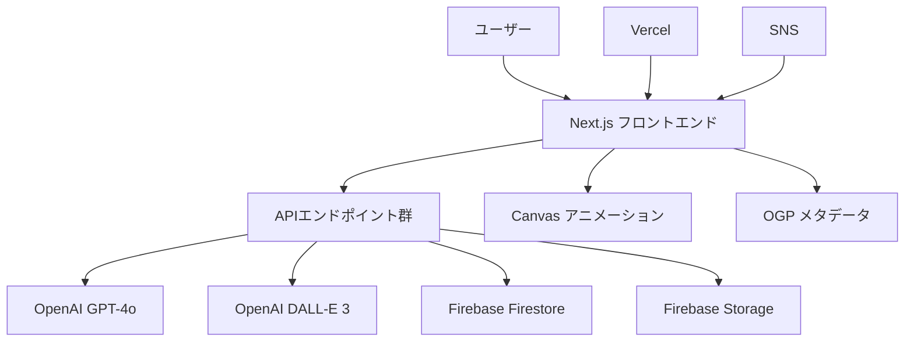
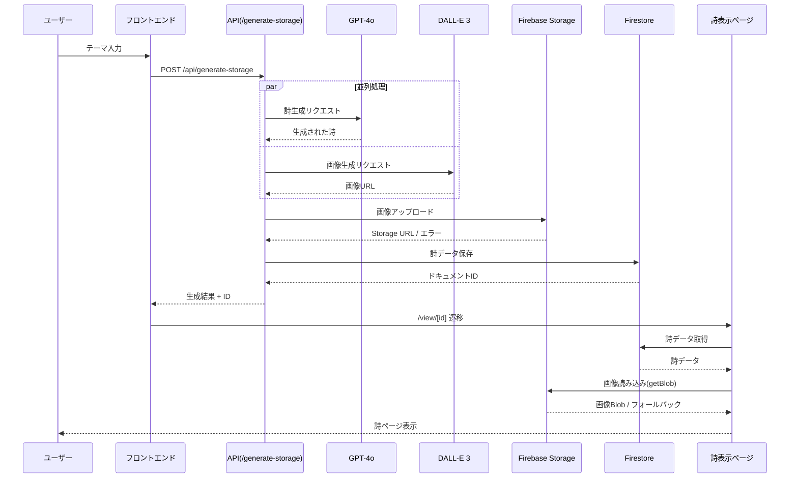

# 🏗️ ゆるVibe Pages アーキテクチャ概要

> *美しい詩と技術の調和を目指したシステム設計*

## 📋 システム概要

ゆるVibe Pagesは、OpenAI APIを活用してユーザーの感情テーマから詩と背景画像を生成し、ソーシャル共有可能な美しいページを提供するNext.jsアプリケーションです。

## 🏛️ 全体アーキテクチャ



## 🔧 技術スタック詳細

### フロントエンド層
| 技術 | バージョン | 用途 |
|------|-----------|------|
| **Next.js** | 15.3.5 | SSR/SSG、App Router、APIルート |
| **React** | 19.0.0 | UI コンポーネント、状態管理 |
| **Tailwind CSS** | v4 | スタイリング、レスポンシブデザイン |
| **Canvas 2D API** | ネイティブ | パーティクルアニメーション |

### バックエンド・API層
| 技術 | バージョン | 用途 |
|------|-----------|------|
| **OpenAI API** | v5.9.0 | GPT-4o詩生成、DALL-E 3画像生成 |
| **Firebase** | v11.10.0 | Firestore DB、Storage画像保存 |
| **nanoid** | v5.1.5 | ユニークID生成 |

### インフラ・デプロイ層
| 技術 | 用途 |
|------|------|
| **Vercel** | ホスティング、CI/CD |
| **Firebase Project** | クラウドデータベース・ストレージ |
| **環境変数** | API キー管理 |

## 🔄 データフロー設計

### メインフロー（詩生成〜表示）



### エラーハンドリング・フォールバック戦略

```mermaid
graph TD
    A[画像読み込み開始] --> B{Firebase getBlob()}
    B -->|成功| C[Object URL作成]
    B -->|失敗| D{getDownloadURL()}
    D -->|成功| E[URL直接使用]
    D -->|失敗| F[緊急フォールバック画像]
    
    G[Storage保存] --> H{アップロード成功？}
    H -->|成功| I[Storage URL使用]
    H -->|失敗| J[DALL-E URL直接保存]
```

## 📁 実際のファイル構造

```
src/
├── app/
│   ├── api/                       # 6つのAPIエンドポイント
│   │   ├── generate-storage/      # メイン本番API
│   │   ├── generate-safe/         # 安全版テスト
│   │   ├── generate-simple/       # シンプル版
│   │   ├── generate-direct/       # Storage回避版
│   │   ├── generate-dummy/        # ダミーデータ版
│   │   └── generate/              # 基本版
│   ├── page.js                    # ホーム（テーマ入力）
│   ├── view/[id]/page.js          # 詩表示ページ
│   ├── test-*/                    # 4つのテストページ
│   ├── debug/                     # デバッグページ
│   ├── layout.js                  # 全体レイアウト
│   └── globals.css                # グローバルスタイル
├── lib/
│   ├── firebase.js                # Firebase初期化
│   ├── firestore.js               # Firestore操作
│   ├── storage.js                 # Storage操作
│   ├── openai.js                  # GPT-4o API
│   ├── dalle.js                   # DALL-E 3 API
│   ├── firebase-image.js          # CORS対応画像読み込み
│   └── dummy-data.js              # テスト用データ
└── components/
    ├── FloatingParticles.js       # Canvas パーティクル
    ├── BackgroundImage.js         # 背景画像コンポーネント
    └── EmergencyBackground.js     # フォールバック背景
```

## 🗄️ データベース設計戦略

### 設計方針
- **Firestore**: 詩データとメタデータの永続化
- **Firebase Storage**: 画像ファイルの効率的な保存・配信
- **CORS対応**: Firebase SDK getBlob() による制約回避
- **フォールバック**: Storage失敗時のDALL-E URL直接使用

詳細なデータモデル、コレクション構造、Storage設計については、[API設計書](../05_api_design/api-specification.md#データモデル) を参照してください。
```

## 🚀 API アーキテクチャ

### API設計戦略
- **複数エンドポイント**: 本番用・テスト用・デバッグ用の段階的実装
- **並列処理**: GPT-4o と DALL-E 3 の同時実行によるパフォーマンス最適化
- **フォールバック**: Storage失敗時の自動フォールバック機能
- **エラーハンドリング**: 外部API障害に対する堅牢な対応

詳細なAPI仕様については、[API設計書](../05_api_design/api-specification.md) を参照してください。

## 🎨 フロントエンド アーキテクチャ

### コンポーネント設計

```mermaid
graph TD
    A[layout.js] --> B[page.js - ホーム]
    A --> C[view/[id]/page.js]
    
    B --> D[テーマ入力フォーム]
    B --> E[FloatingParticles]
    
    C --> F[BackgroundImage]
    C --> G[詩表示部分]
    C --> H[SNS共有ボタン]
    C --> I[FloatingParticles]
    
    F --> J[Emergency Background]
```

### 状態管理
- **React State**: ローカル状態（入力値、読み込み状態）
- **URL State**: 詩ID（Dynamic Routes）
- **Firebase**: 永続化データ
- **Object URL**: 画像メモリ管理

### スタイリング戦略
- **Tailwind CSS v4**: ユーティリティファースト
- **グラスモーフィズム**: 半透明効果
- **レスポンシブ**: モバイルファースト
- **アニメーション**: Canvas 2D API

## 🔒 セキュリティ考慮事項

### 現在の実装状況
- ✅ **環境変数**: API キー適切管理
- ✅ **CORS対応**: Firebase Storage問題解決
- ✅ **入力サニタイズ**: XSS対策
- 🟡 **Firestore Rules**: 開発用設定
- 🔴 **レート制限**: 未実装
- 🔴 **認証**: 未実装

### セキュリティ強化計画
1. **Firestore セキュリティルール** 実装
2. **API レート制限** 導入
3. **入力バリデーション** 強化
4. **ログ監視** システム導入

## ⚡ パフォーマンス最適化

### 実装済み最適化
- **並列処理**: GPT-4o + DALL-E 3 同時実行
- **画像最適化**: 16:9アスペクト比、適切なサイズ
- **メモリ管理**: Object URL 自動クリーンアップ
- **フォールバック**: 段階的エラー回復
- **Canvas最適化**: requestAnimationFrame 使用

### パフォーマンス指標
- **API応答時間**: 通常 8-12秒
- **画像読み込み**: getBlob() < 2秒
- **ページ遷移**: Next.js最適化
- **アニメーション**: 60fps 維持

## 🌐 OGP・SNS対応

### 動的OGP生成
```javascript
// generateMetadata() 関数
{
  title: `${theme} - ゆるVibe Pages`,
  description: phrase,
  openGraph: {
    images: [{ 
      url: imageUrl, 
      width: 1792, 
      height: 1024 
    }]
  },
  twitter: { 
    card: "summary_large_image" 
  }
}
```

### SNS最適化
- **Twitter/X**: 画像 + テキスト自動共有
- **16:9 画像**: SNS表示最適化
- **ハッシュタグ**: #ゆるVibePages 自動付与

## 🔄 デプロイメント・CI/CD

### Vercel デプロイ
- **自動デプロイ**: Git push で本番反映
- **プレビュー**: PR毎にプレビューURL
- **環境変数**: Vercel Dashboard管理
- **ドメイン**: vercel.app サブドメイン

### ビルド最適化
- **Next.js 15**: 最新最適化機能
- **Tailwind Purge**: 未使用CSS削除
- **画像最適化**: Next.js Image最適化
- **Bundle分析**: 依存関係最適化

## 📈 監視・分析

### 現在の監視
- **Console ログ**: 詳細な処理ログ
- **エラーハンドリング**: 段階的フォールバック
- **パフォーマンス**: API応答時間計測
- **Firebase ログ**: Storage・Firestore操作

### 拡張監視計画
- **Vercel Analytics**: アクセス分析
- **Error Tracking**: Sentry等
- **Performance**: Web Vitals
- **Business**: 詩生成数・共有数

## 🚀 将来の拡張性

### Phase 3: セキュリティ強化
- Firebase Auth ユーザー認証
- セキュリティルール実装
- API レート制限

### Phase 4: 機能拡張
- いいね・コメント機能
- 詩一覧・検索機能
- カテゴリ・タグ機能

### Phase 5: 高度な機能
- AI学習データ活用
- リアルタイム機能
- アナリティクス

---

> *「技術と芸術の融合。それがこのアーキテクチャの美しさ、にゃ〜」* ✨