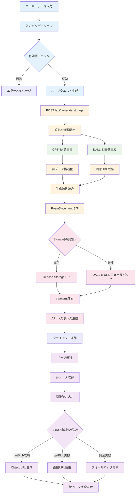
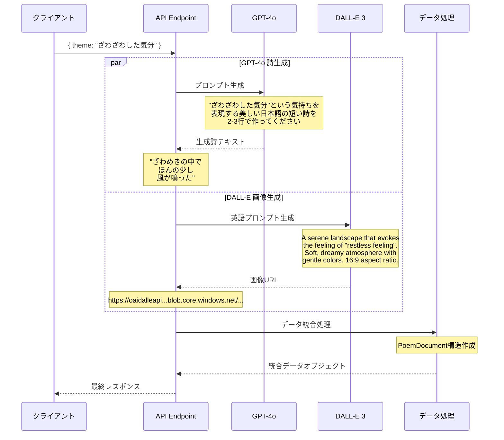
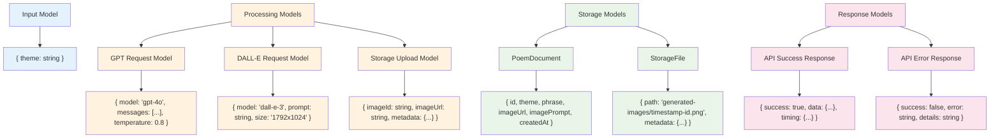
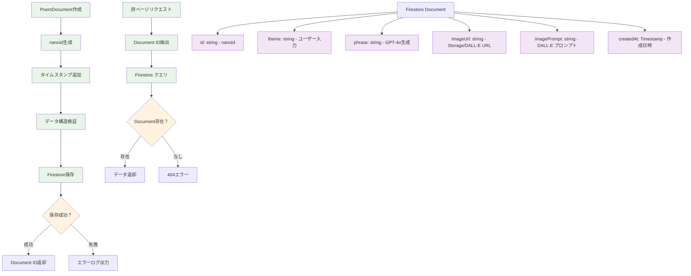
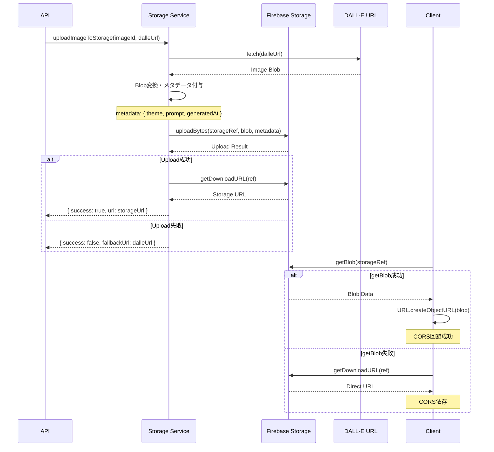
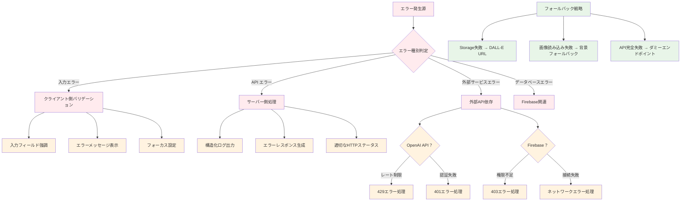
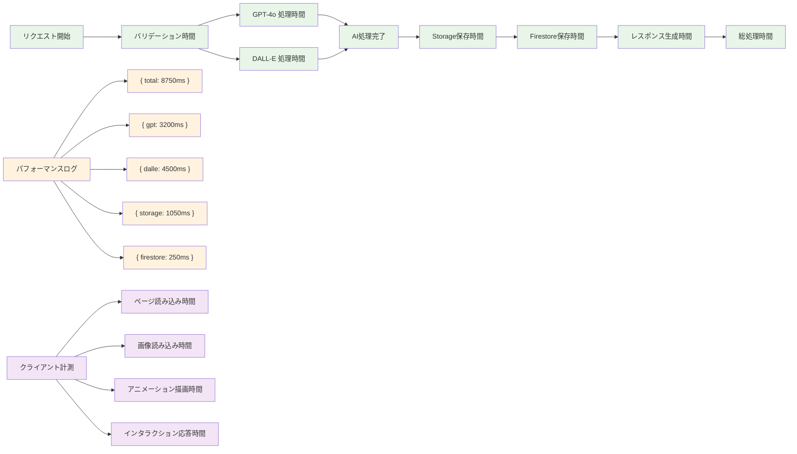
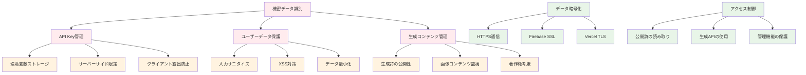
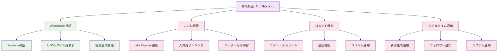

# 📊 ゆるVibe Pages データフロー詳細図

> *情報の流れと変換プロセスの包括的可視化*

## データフロー概要

このデータフロー図は、ゆるVibe Pagesにおけるデータの生成・変換・永続化・表示の全プロセスを詳細に表現しています。ユーザー入力からAI生成、Firebase保存、画面表示まで、データがどのように流れ、どこで変換されるかを正確に示しています。

## メインデータフロー



## 詳細データ変換プロセス

### 入力データ変換

```mermaid
graph LR
    A[ユーザー入力: string] --> B[trim処理]
    B --> C[長さ制限チェック]
    C --> D[文字種類バリデーション]
    D --> E[サニタイズ処理]
    E --> F[テーマオブジェクト作成]
    
    F --> G[{"{ theme: string }"}]
    G --> H[JSON文字列化]
    H --> I[HTTP POST Body]
    
    %% バリデーション詳細
    J[バリデーションルール] --> K[必須: 1文字以上]
    J --> L[最大: 100文字]
    J --> M[XSS対策: HTML エスケープ]

    classDef input fill:#e3f2fd
    classDef validation fill:#fff3e0
    classDef output fill:#e8f5e8

    class A,B,C,D,E input
    class J,K,L,M validation
    class F,G,H,I output
```

### AI データ生成変換



### データモデル変換階層



## Firebase データフロー詳細

### Firestore データ操作



### Storage データフロー



## エラーハンドリング データフロー



## パフォーマンス監視データ

### タイミング データ収集



## データセキュリティフロー

### セキュアデータ処理



## 将来のデータフロー拡張

### リアルタイム機能データフロー



---

> *「データの流れは川の調べのように。情報が美しく変換され、心に届く詩となる、にゃ〜」* ✨