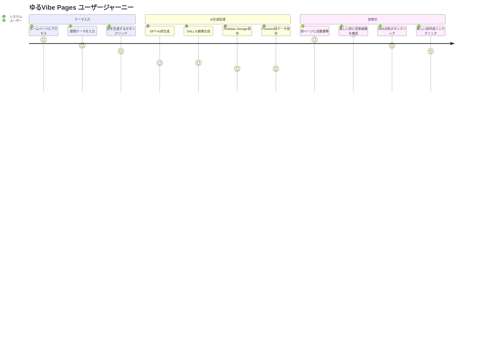
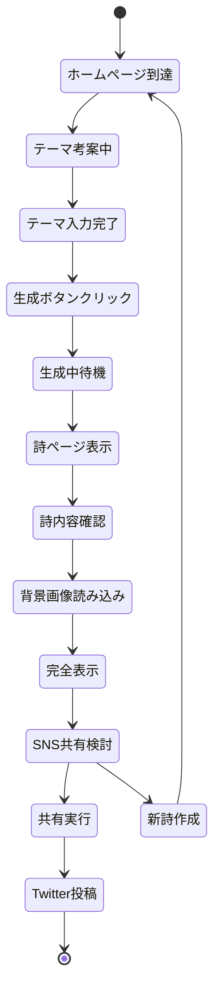
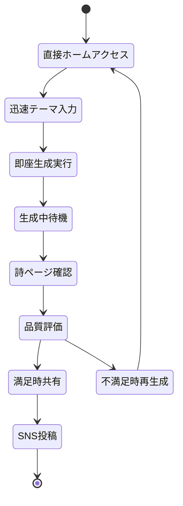
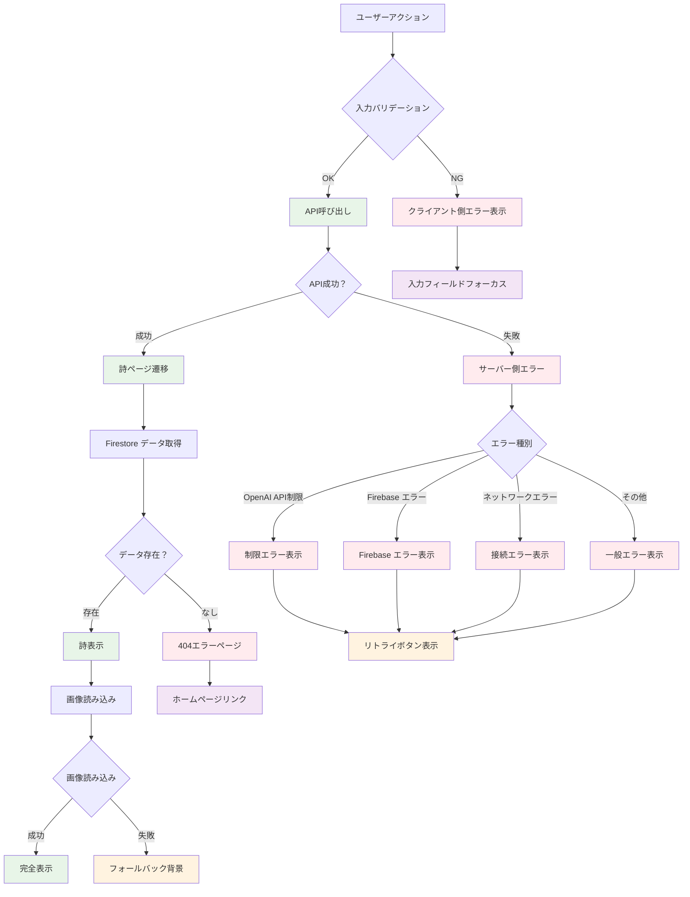
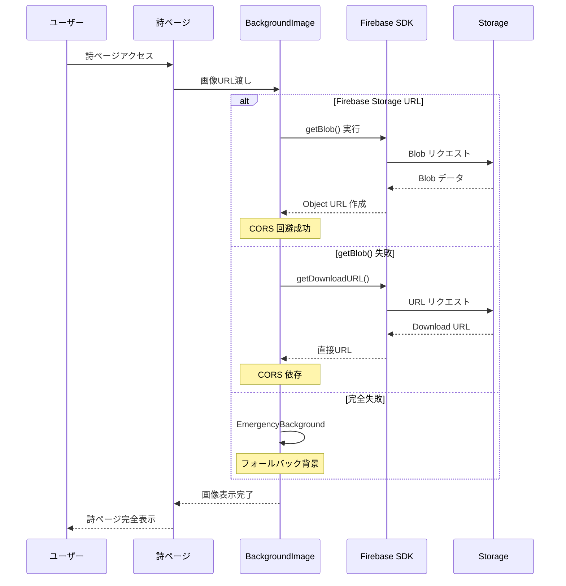

# 🌊 ゆるVibe Pages ページ遷移フロー図

> *ユーザー体験の流れと開発者向けテストフローの包括的可視化*

## フロー概要

このページ遷移図は、ゆるVibe Pagesの実装済み画面遷移を正確に表現しています。メインユーザーフローと、開発・テスト用フローの両方を網羅し、Next.js App Routerの動的ルーティングも含めた全体像を示しています。

## メインユーザーフロー



## 詳細ページ遷移図

```mermaid
graph TD
    A[/ - ホームページ] --> B{テーマ入力}
    B -->|空文字| C[エラー表示]
    B -->|有効| D[ローディング開始]
    C --> B
    
    D --> E[POST /api/generate-storage]
    E --> F{API成功？}
    
    F -->|失敗| G[エラーメッセージ表示]
    F -->|成功| H[/view/[id] - 詩表示ページ]
    G --> B
    
    H --> I[Firestore詩データ取得]
    I --> J{データ存在？}
    J -->|なし| K[404エラーページ]
    J -->|あり| L[詩内容表示]
    
    L --> M[Firebase画像読み込み]
    M --> N{画像読み込み成功？}
    N -->|成功| O[背景画像表示]
    N -->|失敗| P[フォールバック背景]
    
    O --> Q[SNS共有ボタン]
    P --> Q
    Q --> R{ユーザーアクション}
    
    R -->|X共有| S[Twitter共有画面]
    R -->|新しい詩| A
    R -->|ページ共有| T[URL コピー]
    
    S --> U[外部Twitter]
    T --> V[共有完了通知]
    V --> H

    %% スタイル定義
    classDef mainPage fill:#e3f2fd
    classDef apiCall fill:#fff3e0
    classDef dataOp fill:#e8f5e8
    classDef userAction fill:#fce4ec
    classDef external fill:#f3e5f5

    class A,H mainPage
    class E,I,M apiCall
    class J,N dataOp
    class B,R,Q userAction
    class S,U external
```

## テスト・デバッグページフロー

```mermaid
graph TD
    A[/ - ホームページ] --> B{開発者モード？}
    B -->|No| C[通常ユーザーフロー]
    B -->|Yes| D[テストページ群アクセス]
    
    D --> E[/test - 基本APIテスト]
    D --> F[/test-simple - Safe版テスト]
    D --> G[/test-dummy - ダミー版テスト]
    D --> H[/test-sdk - SDK CORS テスト]
    D --> I[/debug - Storage デバッグ]
    
    E --> J[POST /api/generate]
    F --> K[POST /api/generate-safe]
    G --> L[POST /api/generate-dummy]
    
    J --> M{API レスポンス}
    K --> M
    L --> M
    
    M -->|成功| N[結果表示 + 詩ページリンク]
    M -->|失敗| O[エラー詳細表示]
    
    N --> P[/view/[id] へ遷移可能]
    O --> Q[リトライボタン]
    Q --> E
    
    H --> R[Firebase SDK getBlob() テスト]
    R --> S[既存画像ID選択]
    S --> T{画像読み込み}
    T -->|成功| U[パフォーマンス情報表示]
    T -->|失敗| V[CORS エラー詳細]
    
    I --> W[Storage詳細調査]
    W --> X[詩ID入力]
    X --> Y{Firestore取得}
    Y -->|成功| Z[画像読み込みテスト実行]
    Y -->|失敗| AA[Firestore エラー表示]
    
    Z --> BB{画像アクセス}
    BB -->|成功| CC[img + CSS background 両方テスト]
    BB -->|失敗| DD[CORS/権限エラー記録]

    %% スタイル定義
    classDef testPage fill:#e8f5e8
    classDef debugPage fill:#fff3e0
    classDef apiEndpoint fill:#fce4ec
    classDef result fill:#f3e5f5

    class E,F,G,H,I testPage
    class W,X,Y,Z debugPage
    class J,K,L,R apiEndpoint
    class M,N,O,U,V result
```

## Next.js App Router 構造

```mermaid
graph LR
    A[src/app/] --> B[layout.js]
    A --> C[page.js /]
    A --> D[view/]
    A --> E[test/]
    A --> F[test-simple/]
    A --> G[test-dummy/]
    A --> H[test-sdk/]
    A --> I[debug/]
    A --> J[api/]
    
    D --> K[[id]/page.js]
    
    E --> L[page.js]
    F --> M[page.js]
    G --> N[page.js]
    H --> O[page.js]
    I --> P[page.js]
    
    J --> Q[generate/route.js]
    J --> R[generate-safe/route.js]
    J --> S[generate-storage/route.js]
    J --> T[generate-dummy/route.js]
    J --> U[generate-simple/route.js]
    J --> V[generate-direct/route.js]

    %% ルート種別スタイル
    classDef staticRoute fill:#e3f2fd
    classDef dynamicRoute fill:#fff3e0
    classDef apiRoute fill:#e8f5e8
    classDef testRoute fill:#fce4ec

    class C,L,M,N,O,P staticRoute
    class K dynamicRoute
    class Q,R,S,T,U,V apiRoute
    class E,F,G,H,I testRoute
```

## ユーザー体験マップ

### 初回訪問ユーザー


### リピーターユーザー


## 開発者フロー詳細

### API テスト戦略
```mermaid
graph TD
    A[開発者] --> B{テスト目的}
    
    B -->|基本機能確認| C[/test]
    B -->|安全性確認| D[/test-simple] 
    B -->|オフライン開発| E[/test-dummy]
    B -->|CORS問題調査| F[/test-sdk]
    B -->|詳細デバッグ| G[/debug]
    
    C --> H[/api/generate 呼び出し]
    D --> I[/api/generate-safe 呼び出し]
    E --> J[/api/generate-dummy 呼び出し]
    
    F --> K[Firebase getBlob() テスト]
    G --> L[Storage + Firestore 詳細調査]
    
    H --> M{結果確認}
    I --> M
    J --> M
    K --> N{CORS対応確認}
    L --> O{問題特定}
    
    M -->|OK| P[本番デプロイ準備]
    M -->|NG| Q[エラー調査]
    N -->|OK| R[SDK実装成功]
    N -->|NG| S[CORS設定確認]
    O -->|特定| T[修正実行]
    O -->|不明| U[さらなる調査]

    %% 開発フェーズスタイル
    classDef devAction fill:#e8f5e8
    classDef testResult fill:#fff3e0
    classDef decision fill:#fce4ec

    class A,C,D,E,F,G devAction
    class M,N,O testResult
    class B,P,Q,R,S,T,U decision
```

## エラーハンドリングフロー



## パフォーマンス最適化ポイント

### 画像読み込み最適化フロー


---

> *「ページの流れは詩の調べのように。ユーザーの心に寄り添う優雅な遷移を、にゃ〜」* ✨