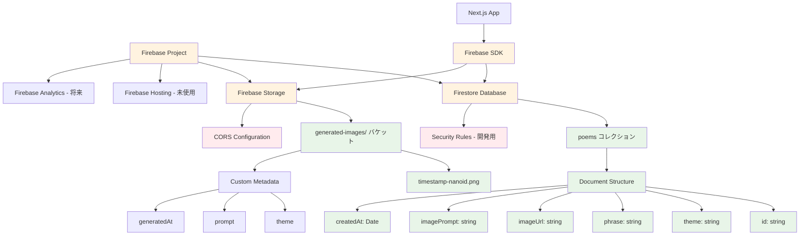
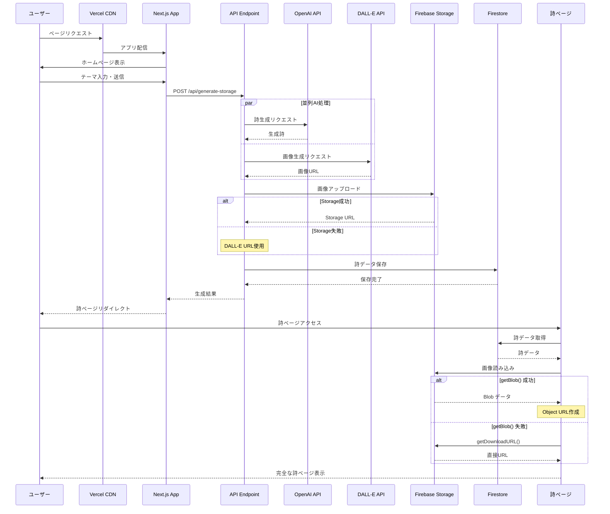
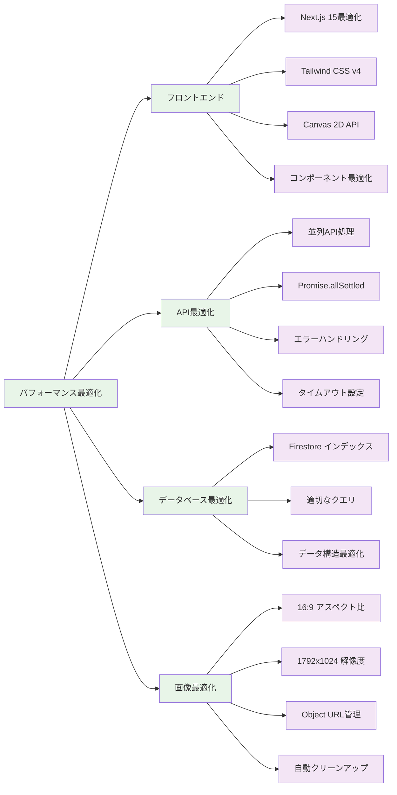
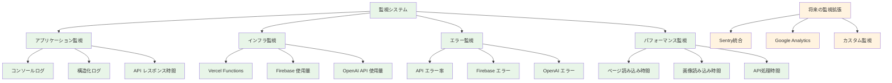
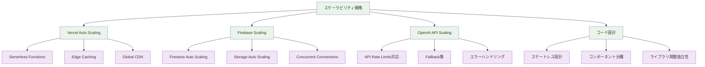
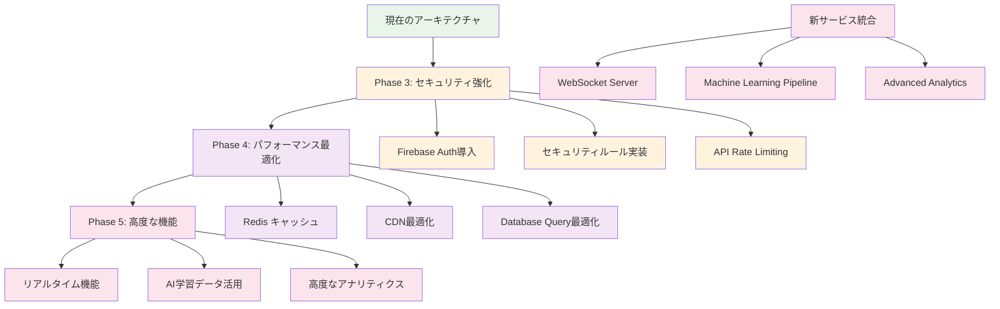

# 🏗️ ゆるVibe Pages システム構成概要図

> *インフラ・サービス・API の全体アーキテクチャ俯瞰*

## システム構成概要

このシステム構成図は、ゆるVibe Pagesのインフラストラクチャ、外部サービス連携、内部アーキテクチャの全体像を表現しています。Vercelホスティング、Firebase サービス群、OpenAI API、フロントエンド・バックエンドの関係性を包括的に示しています。

## 全体システム構成図

```mermaid
graph TB
    %% ユーザー層
    U[ユーザー] --> B[ブラウザ]
    S[SNS ユーザー] --> X[Twitter/X]
    
    %% CDN・ホスティング層
    B --> V[Vercel CDN]
    V --> N[Next.js 15 App]
    
    %% フロントエンド層
    N --> H[ホームページ /]
    N --> P[詩表示ページ /view/[id]]
    N --> T[テストページ群]
    N --> D[デバッグページ /debug]
    
    %% APIルーティング層  
    N --> A1[/api/generate-storage]
    N --> A2[/api/generate-safe]
    N --> A3[/api/generate-dummy]
    N --> A4[/api/generate-simple]
    N --> A5[/api/generate-direct]
    N --> A6[/api/generate]
    
    %% 外部AI サービス層
    A1 --> O[OpenAI GPT-4o]
    A1 --> G[OpenAI DALL-E 3]
    A2 --> O
    A2 --> G
    A6 --> O
    A6 --> G
    
    %% Firebase サービス層
    A1 --> FS[Firebase Storage]
    A1 --> FD[Firebase Firestore]
    A2 --> FD
    A6 --> FS
    A6 --> FD
    P --> FD
    D --> FS
    D --> FD
    
    %% データ永続化層
    FD --> PD[(Poems Collection)]
    FS --> IMG[(Generated Images)]
    
    %% 外部画像サービス
    A3 --> US[Unsplash API]
    
    %% SNS 連携
    P --> X
    X --> SH[SNS 共有]
    
    %% 監視・分析（将来拡張）
    V --> AN[Vercel Analytics]
    FD --> FB[Firebase Analytics]

    %% スタイル定義
    classDef user fill:#e1f5fe
    classDef hosting fill:#e8f5e8
    classDef frontend fill:#f3e5f5
    classDef api fill:#fff3e0
    classDef external fill:#ffebee
    classDef database fill:#fce4ec
    classDef monitoring fill:#f1f8e9

    class U,S,B user
    class V,N hosting
    class H,P,T,D frontend
    class A1,A2,A3,A4,A5,A6 api
    class O,G,US,X external
    class FS,FD,PD,IMG database
    class AN,FB monitoring
```

## インフラストラクチャ詳細

### Vercel デプロイメント構成

```mermaid
graph LR
    A[Git Repository] --> B[Vercel Build]
    B --> C[Next.js Build]
    C --> D[Static Generation]
    C --> E[Server Functions]
    
    D --> F[Vercel Edge Network]
    E --> G[Vercel Serverless Functions]
    
    F --> H[Global CDN]
    G --> I[API Endpoints]
    
    H --> J[Static Assets]
    I --> K[Dynamic API Routes]
    
    J --> L[CSS/JS/Images]
    K --> M[/api/* Routes]

    %% 環境変数
    N[Environment Variables] --> G
    N --> O[OPENAI_API_KEY]
    N --> P[FIREBASE_CONFIG]

    %% スタイル
    classDef build fill:#e8f5e8
    classDef deploy fill:#f3e5f5
    classDef runtime fill:#fff3e0

    class A,B,C build
    class D,E,F,G deploy
    class H,I,J,K,L,M runtime
```

### Firebase プロジェクト構成



## API アーキテクチャ詳細

### API エンドポイント戦略

```mermaid
graph TD
    A[クライアントリクエスト] --> B{エンドポイント選択}
    
    B -->|本番| C[/api/generate-storage]
    B -->|テスト| D[/api/generate-safe]
    B -->|開発| E[/api/generate-dummy]
    B -->|高速| F[/api/generate-simple]
    B -->|直接| G[/api/generate-direct]
    B -->|基本| H[/api/generate]
    
    %% Storage版（メイン）
    C --> I[GPT-4o + DALL-E 並列]
    I --> J[Firebase Storage 保存]
    J --> K{Storage成功？}
    K -->|成功| L[Storage URL使用]
    K -->|失敗| M[DALL-E URL フォールバック]
    L --> N[Firestore保存]
    M --> N
    
    %% Safe版
    D --> O[GPT-4o + Safe DALL-E]
    O --> P[基本Firestore保存]
    
    %% Dummy版
    E --> Q[DummyData Service]
    Q --> R[Unsplash画像]
    R --> S[Dummy Firestore保存]
    
    %% Simple版
    F --> T[GPT-4o + DALL-E]
    T --> U[Storage回避]
    U --> V[DALL-E URL直接保存]
    
    %% Direct版
    G --> W[DALL-E URL直接使用]
    W --> X[即座Firestore保存]
    
    %% Basic版
    H --> Y[標準GPT-4o + DALL-E]
    Y --> Z[標準Firestore保存]

    classDef mainEndpoint fill:#e8f5e8
    classDef testEndpoint fill:#fff3e0
    classDef process fill:#f3e5f5
    classDef storage fill:#fce4ec

    class C mainEndpoint
    class D,E,F,G,H testEndpoint
    class I,O,Q,T,W,Y process
    class J,K,L,M,N,P,S,V,X,Z storage
```

### データフロー アーキテクチャ



## セキュリティ・認証構成

### 現在のセキュリティ実装

```mermaid
graph TD
    A[セキュリティレイヤー] --> B[環境変数管理]
    A --> C[API Key保護]
    A --> D[CORS対応]
    A --> E[入力サニタイズ]
    
    B --> F[Vercel Environment Variables]
    F --> G[OPENAI_API_KEY]
    F --> H[FIREBASE_CONFIG]
    
    C --> I[サーバーサイド限定]
    C --> J[クライアント露出なし]
    
    D --> K[Firebase SDK getBlob()]
    D --> L[CORS設定回避]
    
    E --> M[React標準サニタイズ]
    E --> N[XSS対策]
    
    %% 将来の強化予定
    O[将来のセキュリティ強化] --> P[Firebase Auth]
    O --> Q[Firestore Security Rules]
    O --> R[API Rate Limiting]
    O --> S[Content Moderation]

    classDef current fill:#e8f5e8
    classDef future fill:#fff3e0
    classDef protection fill:#ffebee

    class A,B,C,D,E,F,G,H,I,J,K,L,M,N current
    class O,P,Q,R,S future
    class G,H,I,J protection
```

## パフォーマンス・監視構成

### パフォーマンス最適化



### 監視・ログ戦略



## スケーラビリティ設計

### 水平スケーリング対応



## 将来拡張アーキテクチャ

### Phase 3-5 拡張予定



---

> *「システムの構成は宇宙の調和のように。美しい秩序で心に響く体験を紡ぐ、にゃ〜」* ✨