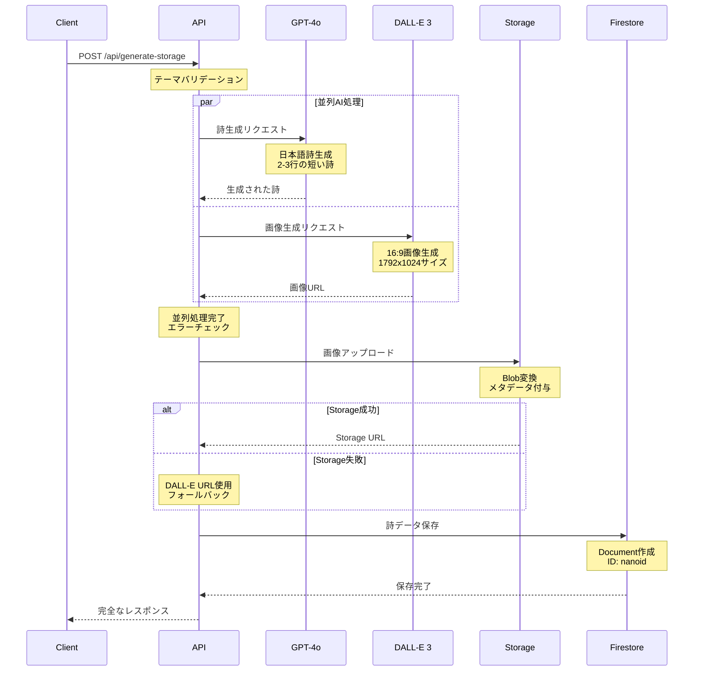

# 🚀 ゆるVibe Pages API設計仕様書

> *詩と技術の美しい調和を生み出すAPI群*

## 📋 API概要

ゆるVibe PagesのAPIは、ユーザーの感情テーマから美しい詩と背景画像を生成するための6つのエンドポイントを提供します。各エンドポイントは異なる用途と特徴を持ち、開発・テスト・本番環境に対応しています。

## 🎯 API設計思想

### 核となる原則
- **段階的フォールバック**: エラー時の優雅な回復
- **並列処理**: GPT-4oとDALL-E 3の同時実行
- **統一されたレスポンス**: 一貫したAPI体験
- **詳細なログ**: トラブルシューティング支援
- **スケーラビリティ**: 将来の機能拡張に対応

## 🔗 エンドポイント一覧

| エンドポイント | 状態 | 用途 | 特徴 |
|---------------|------|------|------|
| `/api/generate-storage` | 🟢 **本番** | メイン実装 | Storage保存、完全フォールバック |
| `/api/generate-safe` | 🟡 テスト | 安全版 | 基本機能のみ |
| `/api/generate-simple` | 🟡 テスト | 最小実装 | デバッグ・検証用 |
| `/api/generate-direct` | 🟡 テスト | Storage回避 | DALL-E URL直接使用 |
| `/api/generate-dummy` | 🟡 開発 | オフライン | API未使用、ダミーデータ |
| `/api/generate` | 🟡 レガシー | 基本版 | 標準的な実装 |

## 🌟 メインAPI: `/api/generate-storage`

### 概要
本番環境で使用されるメインAPIエンドポイント。OpenAI APIを活用した詩・画像生成から、Firebase Storageへの保存、Firestoreへのメタデータ保存まで、完全なフローを提供します。

### エンドポイント詳細

**URL**: `POST /api/generate-storage`

**Content-Type**: `application/json`

### リクエスト仕様

```json
{
  "theme": "string (required)"
}
```

**パラメータ詳細:**
- `theme`: ユーザーが入力する感情テーマ（例: "ざわざわした気分", "安心したい"）
  - 最小長: 1文字
  - 最大長: 100文字（推奨）
  - 日本語の感情表現を想定

### レスポンス仕様

#### 成功時 (200 OK)

```json
{
  "success": true,
  "data": {
    "id": "xyz123abc",
    "phrase": "ざわめきの中で\nほんの少し\n風が鳴った",
    "imageUrl": "https://firebasestorage.googleapis.com/v0/b/project/o/generated-images%2F1234567890-xyz123abc.png?alt=media&token=...",
    "theme": "ざわざわした気分"
  },
  "timing": {
    "total": 8750,
    "gpt": 3200,
    "dalle": 4500,
    "storage": 1050
  }
}
```

**レスポンスフィールド詳細:**

| フィールド | 型 | 説明 |
|-----------|-----|------|
| `success` | boolean | 処理成功フラグ |
| `data.id` | string | 生成された詩のユニークID (nanoid) |
| `data.phrase` | string | 生成された詩（2-3行、改行区切り） |
| `data.imageUrl` | string | Firebase Storage画像URL |
| `data.theme` | string | 入力されたテーマ（確認用） |
| `timing.total` | number | 総処理時間（ミリ秒） |
| `timing.gpt` | number | GPT-4o処理時間（ミリ秒） |
| `timing.dalle` | number | DALL-E 3処理時間（ミリ秒） |
| `timing.storage` | number | Storage保存時間（ミリ秒） |

#### エラー時 (500 Internal Server Error)

```json
{
  "success": false,
  "error": "OpenAI API error",
  "details": "Rate limit exceeded",
  "timestamp": "2025-07-13T10:30:00.000Z"
}
```

### 処理フロー詳細



### エラーハンドリング

#### AI生成エラー
- **GPT-4o失敗**: エラー即座に返却、詩生成不可
- **DALL-E失敗**: エラー即座に返却、画像生成不可
- **レート制限**: 429エラー、リトライ推奨

#### Storage関連エラー
- **アップロード失敗**: DALL-E URLを直接使用（フォールバック）
- **権限エラー**: Firebase設定確認が必要
- **容量制限**: Storage設定確認が必要

#### Firestore関連エラー
- **保存失敗**: データベース接続確認
- **権限エラー**: セキュリティルール確認

### パフォーマンス特性

#### 標準的な処理時間
- **GPT-4o**: 2-5秒
- **DALL-E 3**: 4-8秒
- **Storage保存**: 0.5-2秒
- **Firestore保存**: 0.1-0.5秒
- **総処理時間**: 7-15秒

#### 最適化ポイント
- **並列処理**: GPT-4o + DALL-E同時実行で約50%高速化
- **ストリーミング**: レスポンス即座返却
- **フォールバック**: Storage失敗時の即座切り替え

## 🧪 テスト用API群

### `/api/generate-safe` - 安全版

**用途**: 基本機能テスト、エラーハンドリング検証

**特徴**:
- シンプルなエラーハンドリング
- 基本的なGPT-4o + DALL-E処理
- Storage機能なし（DALL-E URL直接使用）

**レスポンス例**:
```json
{
  "success": true,
  "data": {
    "id": "abc123xyz",
    "phrase": "生成された詩",
    "imageUrl": "https://oaidalleapiprodscus.blob.core.windows.net/...",
    "theme": "テーマ"
  }
}
```

### `/api/generate-simple` - 最小実装

**用途**: デバッグ、基本動作確認

**特徴**:
- 最小限のエラーハンドリング
- 詳細ログ出力
- 高速レスポンス

### `/api/generate-direct` - Storage回避版

**用途**: Firebase Storage問題回避、高速テスト

**特徴**:
- DALL-E URL直接使用
- Storage処理スキップ
- 高速処理（Storage保存時間削減）

### `/api/generate-dummy` - オフライン版

**用途**: オフライン開発、UI/UXテスト

**特徴**:
- OpenAI API未使用
- 固定のダミーデータ返却
- 即座レスポンス（< 100ms）

**ダミーレスポンス**:
```json
{
  "success": true,
  "data": {
    "id": "dummy123",
    "phrase": "春の風が\nそっと頬を\n撫でていく",
    "imageUrl": "https://picsum.photos/1792/1024",
    "theme": "入力テーマ"
  },
  "timing": {
    "total": 50,
    "gpt": 20,
    "dalle": 20,
    "storage": 10
  }
}
```

### `/api/generate` - レガシー基本版

**用途**: 後方互換性、標準実装

**特徴**:
- 標準的なGPT-4o + DALL-E処理
- 基本的なFirestore保存
- Storage機能なし

## 🔧 共通仕様

### 認証・セキュリティ
- **API Key**: サーバーサイドで管理（環境変数）
- **レート制限**: 現在未実装（将来実装予定）
- **CORS**: Next.js APIルートでブラウザから直接アクセス可能
- **バリデーション**: 入力テーマの基本検証

### ヘッダー
```http
Content-Type: application/json
```

### ステータスコード
- `200`: 成功
- `400`: 不正なリクエスト（バリデーション失敗）
- `429`: レート制限（将来実装）
- `500`: サーバーエラー（AI API失敗、Firebase失敗等）

### エラーレスポンス形式
```json
{
  "success": false,
  "error": "エラー種別",
  "details": "詳細なエラーメッセージ",
  "timestamp": "ISO 8601 タイムスタンプ"
}
```

## 🔄 データ連携

### Firestore保存データ
```javascript
// Collection: poems
{
  id: string,           // nanoid（APIレスポンスのIDと同一）
  theme: string,        // ユーザー入力テーマ
  phrase: string,       // 生成された詩
  imageUrl: string,     // 画像URL（Storage または DALL-E）
  imagePrompt: string,  // DALL-E生成プロンプト
  createdAt: Timestamp  // 作成日時
}
```

### Firebase Storage構造
```
/generated-images/
  {timestamp}-{nanoid}.png
  
メタデータ:
{
  customMetadata: {
    theme: "ユーザーテーマ",
    prompt: "DALL-Eプロンプト",
    generatedAt: "生成日時"
  }
}
```

## 📊 監視・ログ

### ログ出力項目
- **リクエスト開始**: タイムスタンプ、テーマ
- **AI処理時間**: GPT-4o、DALL-E個別時間
- **Storage処理**: アップロード成功/失敗
- **エラー詳細**: API失敗、Firebase失敗
- **総処理時間**: エンドツーエンド

### パフォーマンス監視
```javascript
console.log('API Performance:', {
  endpoint: '/api/generate-storage',
  theme: 'テーマ',
  timing: {
    total: 8750,
    gpt: 3200,
    dalle: 4500,
    storage: 1050
  },
  success: true
});
```

## 🚀 将来の拡張

### Phase 3: セキュリティ強化
- **API Key認証**: ユーザー毎のAPI制限
- **レート制限**: IP/ユーザー毎の制限
- **バリデーション強化**: 入力内容フィルタリング

### Phase 4: 機能拡張
- **バッチ生成**: 複数詩の一括生成
- **スタイル指定**: 詩のスタイル・長さ指定
- **画像スタイル**: アートスタイル選択

### Phase 5: 高度な機能
- **ストリーミング**: リアルタイム生成状況
- **キャッシュ**: 類似テーマの結果キャッシュ
- **学習**: ユーザー好み学習

## 📝 使用例

### JavaScript Fetch例
```javascript
const response = await fetch('/api/generate-storage', {
  method: 'POST',
  headers: {
    'Content-Type': 'application/json',
  },
  body: JSON.stringify({
    theme: 'ざわざわした気分'
  })
});

const result = await response.json();

if (result.success) {
  // 詩表示ページにリダイレクト
  window.location.href = `/view/${result.data.id}`;
} else {
  console.error('生成失敗:', result.error);
}
```

### Next.js コンポーネント使用例
```javascript
const [loading, setLoading] = useState(false);

const handleSubmit = async (theme) => {
  setLoading(true);
  try {
    const response = await fetch('/api/generate-storage', {
      method: 'POST',
      headers: { 'Content-Type': 'application/json' },
      body: JSON.stringify({ theme })
    });
    
    const result = await response.json();
    
    if (result.success) {
      router.push(`/view/${result.data.id}`);
    }
  } catch (error) {
    console.error('API Error:', error);
  }
  setLoading(false);
};
```

---

> *「美しいAPIは、美しい詩を生み出す基盤。技術と芸術の調和、にゃ〜」* ✨