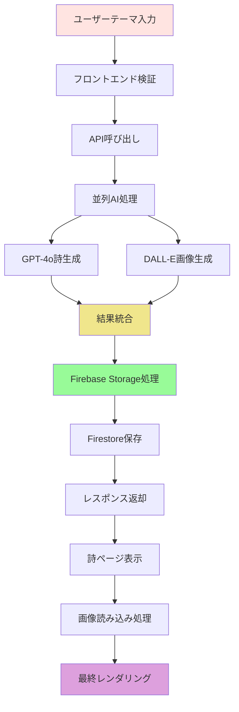
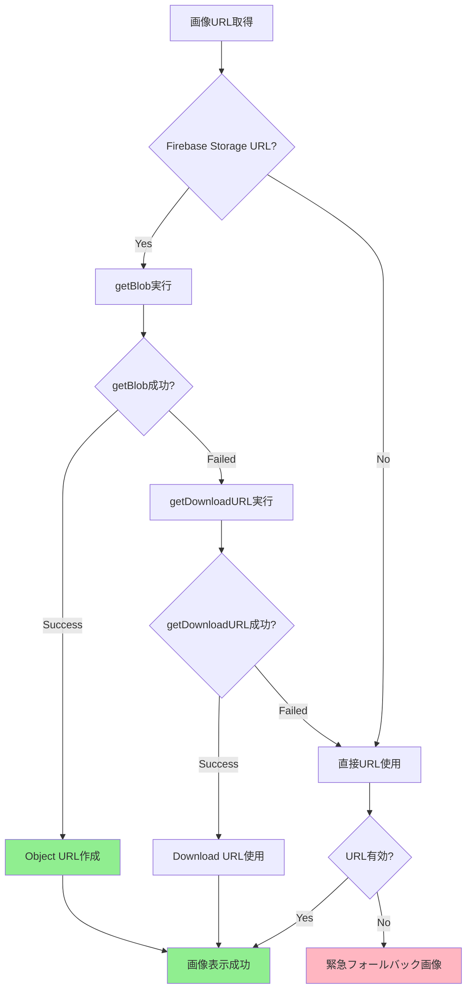
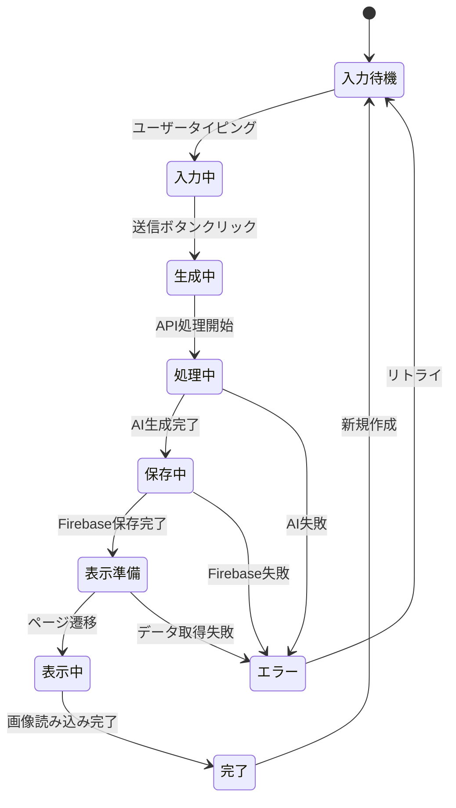

# 📊 ゆるVibe Pages データフロー詳細分析

> *人間とAIの共創開発のための、バグ対応・理解支援を重視したデータフロー文書*

## 📋 分析の目的と背景

このドキュメントは、ゆるVibe Pagesのデータフローを人間開発者が迅速に理解できるよう、詳細な処理フローとデータ変換を記録します。特に、バグ発生時の原因特定と問題解決を支援することを重点としています。

### 人間とAIの共創開発における重要性
- **迅速な問題理解**: バグ発生時の即座な原因特定
- **技術決定の透明性**: なぜその実装を選んだかの背景
- **保守性向上**: 将来の機能追加・修正時の参照

## 🔄 システム全体データフロー概要



## 📝 詳細データフロー分析

### Phase 1: ユーザー入力からAPI呼び出し

#### 1.1 フロントエンド入力処理

**ファイル**: `src/app/page.js`

**データフロー**:
```
ユーザー入力 → 状態管理 → バリデーション → API呼び出し
```

**詳細処理**:
```javascript
// 入力データの流れ
const [theme, setTheme] = useState('');
const [loading, setLoading] = useState(false);

// 1. ユーザー入力の受付
const handleInputChange = (e) => {
  const value = e.target.value;
  setTheme(value);  // React状態更新
};

// 2. 入力バリデーション
const validateTheme = (theme) => {
  if (!theme.trim()) {
    throw new Error('テーマを入力してください');
  }
  if (theme.length > 100) {
    throw new Error('テーマは100文字以内で入力してください');
  }
  return theme.trim();
};

// 3. API呼び出し準備
const handleSubmit = async (e) => {
  e.preventDefault();
  
  try {
    const validatedTheme = validateTheme(theme);
    setLoading(true);
    
    // API呼び出し実行
    const response = await fetch('/api/generate-storage', {
      method: 'POST',
      headers: { 'Content-Type': 'application/json' },
      body: JSON.stringify({ theme: validatedTheme })
    });
    
    const result = await response.json();
    
    if (result.success) {
      // 成功時：詩ページへリダイレクト
      router.push(`/view/${result.data.id}`);
    } else {
      // エラー処理
      console.error('生成エラー:', result.error);
    }
  } catch (error) {
    console.error('送信エラー:', error);
  } finally {
    setLoading(false);
  }
};
```

**重要なデータポイント**:
- **入力形式**: 文字列（日本語感情表現想定）
- **バリデーション**: 空文字・長さ制限
- **状態管理**: React useState
- **エラーハンドリング**: try-catch + ユーザーフィードバック

### Phase 2: API内部処理（メイン：generate-storage）

#### 2.1 APIエンドポイント受信処理

**ファイル**: `src/app/api/generate-storage/route.js`

**データ受信フロー**:
```javascript
export async function POST(request) {
  const startTime = Date.now();
  
  try {
    // 1. リクエストボディ解析
    const body = await request.json();
    const { theme } = body;
    
    console.log('🎯 詩生成開始:', { 
      theme, 
      timestamp: new Date().toISOString() 
    });
    
    // 2. 入力バリデーション（API層）
    if (!theme || typeof theme !== 'string') {
      return Response.json({
        success: false,
        error: 'テーマが無効です'
      }, { status: 400 });
    }
```

#### 2.2 並列AI処理フロー

**最も複雑で重要な処理**：GPT-4oとDALL-E 3の同時実行

```javascript
// 並列処理の実装詳細
const [gptResult, dalleResult] = await Promise.allSettled([
  // GPT-4o詩生成
  openai.chat.completions.create({
    model: "gpt-4o",
    messages: [{
      role: "user",
      content: `"${theme}"という気持ちを表現する、美しい日本語の短い詩を2-3行で作ってください。`
    }],
    max_tokens: 150,
    temperature: 0.8
  }),
  
  // DALL-E 3画像生成
  openai.images.generate({
    model: "dall-e-3",
    prompt: `A serene landscape that evokes the feeling of "${theme}". Soft, dreamy atmosphere with gentle colors. 16:9 aspect ratio.`,
    size: "1792x1024",
    quality: "standard",
    n: 1
  })
]);
```

**エラーハンドリングの詳細**:
```javascript
// 結果検証とエラー処理
let poem = null;
let imageUrl = null;

// GPT-4o結果検証
if (gptResult.status === 'fulfilled') {
  poem = gptResult.value.choices[0].message.content.trim();
  console.log('✅ GPT-4o成功:', { poem, time: gptTime });
} else {
  console.error('❌ GPT-4o失敗:', gptResult.reason);
  return Response.json({
    success: false,
    error: '詩の生成に失敗しました'
  }, { status: 500 });
}

// DALL-E結果検証
if (dalleResult.status === 'fulfilled') {
  imageUrl = dalleResult.value.data[0].url;
  console.log('✅ DALL-E成功:', { imageUrl, time: dalleTime });
} else {
  console.error('❌ DALL-E失敗:', dalleResult.reason);
  return Response.json({
    success: false,
    error: '画像の生成に失敗しました'
  }, { status: 500 });
}
```

**データ変換ポイント**:
- **GPT入力**: 日本語テーマ → 詩生成プロンプト
- **DALL-E入力**: 日本語テーマ → 英語風景プロンプト
- **並列実行**: Promise.allSettled で部分失敗対応
- **タイミング計測**: パフォーマンス監視

#### 2.3 Firebase Storage処理（CORS問題解決）

**最も技術的に複雑な部分**：CORS制約の回避

```javascript
// Storage保存の詳細フロー
let finalImageUrl = imageUrl; // DALL-E URL（フォールバック用）

try {
  console.log('🔄 Storage保存開始');
  
  // 1. DALL-E画像をBlobとして取得
  const imageResponse = await fetch(imageUrl);
  if (!imageResponse.ok) {
    throw new Error(`画像取得失敗: ${imageResponse.status}`);
  }
  
  const imageBlob = await imageResponse.blob();
  console.log('📥 画像Blob取得:', { 
    size: imageBlob.size, 
    type: imageBlob.type 
  });
  
  // 2. Storage参照作成（ユニークファイル名）
  const timestamp = Date.now();
  const filename = `${timestamp}-${nanoid()}.png`;
  const storageRef = ref(storage, `generated-images/${filename}`);
  
  // 3. メタデータ付きアップロード
  const metadata = {
    customMetadata: {
      theme: theme,
      prompt: dallePrompt,
      generatedAt: new Date().toISOString()
    }
  };
  
  const uploadResult = await uploadBytes(storageRef, imageBlob, metadata);
  console.log('✅ Storage保存成功:', uploadResult.metadata.fullPath);
  
  // 4. Storage URLの生成
  const storageUrl = await getDownloadURL(uploadResult.ref);
  finalImageUrl = storageUrl;
  
} catch (storageError) {
  console.warn('⚠️ Storage保存失敗、DALL-E URLを使用:', storageError.message);
  // フォールバック: DALL-E URL をそのまま使用
  finalImageUrl = imageUrl;
}
```

**技術的決定の背景**:

| 問題 | 解決策 | 理由 |
|------|--------|------|
| **CORS制限** | Firebase SDK使用 | ブラウザ制約回避 |
| **失敗時フォールバック** | DALL-E URL保持 | サービス継続性確保 |
| **ファイル名衝突** | timestamp + nanoid | ユニーク性保証 |
| **メタデータ** | customMetadata | デバッグ・分析支援 |

#### 2.4 Firestore保存処理

```javascript
// Firestore保存の詳細
const poemId = nanoid(); // ユニークID生成

const poemData = {
  id: poemId,
  theme: theme,
  phrase: poem,
  imageUrl: finalImageUrl,
  imagePrompt: dallePrompt,
  createdAt: new Date()
};

try {
  await setDoc(doc(db, 'poems', poemId), poemData);
  console.log('✅ Firestore保存成功:', poemId);
} catch (firestoreError) {
  console.error('❌ Firestore保存失敗:', firestoreError);
  return Response.json({
    success: false,
    error: 'データ保存に失敗しました'
  }, { status: 500 });
}
```

**データ構造**:
```typescript
interface PoemDocument {
  id: string;           // nanoid（URL用）
  theme: string;        // ユーザー入力
  phrase: string;       // GPT-4o生成詩
  imageUrl: string;     // Storage URL または DALL-E URL
  imagePrompt: string;  // DALL-E用プロンプト
  createdAt: Date;      // 作成日時
}
```

### Phase 3: 詩ページ表示処理

#### 3.1 動的ルーティングとメタデータ生成

**ファイル**: `src/app/view/[id]/page.js`

```javascript
// 動的OGP生成のデータフロー
export async function generateMetadata({ params }) {
  try {
    // 1. Firestoreから詩データ取得
    const docRef = doc(db, 'poems', params.id);
    const docSnap = await getDoc(docRef);
    
    if (!docSnap.exists()) {
      return { title: '詩が見つかりません' };
    }
    
    const poemData = docSnap.data();
    
    // 2. OGPメタデータ構築
    return {
      title: `${poemData.theme} - ゆるVibe Pages`,
      description: poemData.phrase,
      openGraph: {
        title: `${poemData.theme} - ゆるVibe Pages`,
        description: poemData.phrase,
        images: [{
          url: poemData.imageUrl,
          width: 1792,
          height: 1024,
          alt: `${poemData.theme}をテーマにした詩`
        }],
        type: 'article'
      },
      twitter: {
        card: 'summary_large_image',
        title: `${poemData.theme} - ゆるVibe Pages`,
        description: poemData.phrase,
        images: [poemData.imageUrl]
      }
    };
  } catch (error) {
    console.error('メタデータ生成エラー:', error);
    return { title: 'ゆるVibe Pages' };
  }
}
```

#### 3.2 画像読み込み処理（CORS回避の核心）

**最も技術的に重要な部分**：ブラウザでのStorage画像表示

```javascript
// 画像読み込みの多段階フォールバック
const [imageObjectUrl, setImageObjectUrl] = useState(null);
const [imageError, setImageError] = useState(false);

useEffect(() => {
  if (!poemData?.imageUrl) return;
  
  const loadImage = async () => {
    try {
      console.log('🖼️ 画像読み込み開始:', poemData.imageUrl);
      
      // 方法1: Firebase Storage getBlob() (最優先)
      if (poemData.imageUrl.includes('firebasestorage.googleapis.com')) {
        try {
          const imageRef = ref(storage, poemData.imageUrl);
          const blob = await getBlob(imageRef);
          
          const objectUrl = URL.createObjectURL(blob);
          setImageObjectUrl(objectUrl);
          console.log('✅ getBlob()成功');
          return;
        } catch (blobError) {
          console.warn('⚠️ getBlob()失敗、フォールバック:', blobError.message);
        }
      }
      
      // 方法2: getDownloadURL() (フォールバック)
      try {
        const imageRef = ref(storage, poemData.imageUrl);
        const downloadUrl = await getDownloadURL(imageRef);
        setImageObjectUrl(downloadUrl);
        console.log('✅ getDownloadURL()成功');
        return;
      } catch (urlError) {
        console.warn('⚠️ getDownloadURL()失敗:', urlError.message);
      }
      
      // 方法3: 直接URL使用 (最終フォールバック)
      setImageObjectUrl(poemData.imageUrl);
      console.log('🔄 直接URL使用');
      
    } catch (error) {
      console.error('❌ 画像読み込み完全失敗:', error);
      setImageError(true);
    }
  };
  
  loadImage();
  
  // メモリクリーンアップ
  return () => {
    if (imageObjectUrl && imageObjectUrl.startsWith('blob:')) {
      URL.revokeObjectURL(imageObjectUrl);
    }
  };
}, [poemData?.imageUrl]);
```

**フォールバック戦略の詳細**:



### Phase 4: レンダリングとアニメーション

#### 4.1 Canvas アニメーション データフロー

**ファイル**: `src/components/FloatingParticles.js`

```javascript
// パーティクルシステムのデータフロー
class ParticleSystem {
  constructor(canvas) {
    this.canvas = canvas;
    this.ctx = canvas.getContext('2d');
    this.particles = [];
    this.animationId = null;
    
    // 初期化
    this.initParticles();
    this.animate();
  }
  
  initParticles() {
    // 50個のパーティクル生成
    for (let i = 0; i < 50; i++) {
      this.particles.push({
        x: Math.random() * this.canvas.width,
        y: Math.random() * this.canvas.height,
        vx: (Math.random() - 0.5) * 0.5,
        vy: (Math.random() - 0.5) * 0.5,
        life: Math.random() * 100 + 100
      });
    }
  }
  
  animate() {
    // フレーム毎の更新処理
    this.ctx.clearRect(0, 0, this.canvas.width, this.canvas.height);
    
    this.particles.forEach(particle => {
      // 位置更新
      particle.x += particle.vx;
      particle.y += particle.vy;
      
      // 境界チェック
      if (particle.x < 0 || particle.x > this.canvas.width) {
        particle.vx *= -1;
      }
      if (particle.y < 0 || particle.y > this.canvas.height) {
        particle.vy *= -1;
      }
      
      // 描画
      this.drawParticle(particle);
    });
    
    this.animationId = requestAnimationFrame(() => this.animate());
  }
}
```

**パフォーマンス考慮**:
- **requestAnimationFrame**: 60fps最適化
- **境界チェック**: 無駄な計算削減
- **メモリ管理**: アンマウント時のクリーンアップ

## 🔍 エラーハンドリング・フォールバック詳細

### 主要エラーポイントと対応

| エラーポイント | 発生原因 | フォールバック | ログ出力 |
|---------------|----------|---------------|----------|
| **GPT-4o失敗** | API制限、ネットワーク | エラー即座返却 | ❌ GPT-4o失敗 |
| **DALL-E失敗** | API制限、プロンプト | エラー即座返却 | ❌ DALL-E失敗 |
| **Storage失敗** | 権限、容量、ネットワーク | DALL-E URL使用 | ⚠️ Storage失敗 |
| **Firestore失敗** | 権限、ネットワーク | エラー返却 | ❌ Firestore失敗 |
| **画像読み込み失敗** | CORS、URL無効 | プレースホルダー | 🖼️ 画像失敗 |

### エラー監視データフロー

```javascript
// 構造化エラーログ
const logError = (context, error, additionalData = {}) => {
  const errorLog = {
    timestamp: new Date().toISOString(),
    context: context,
    error: {
      message: error.message,
      type: error.constructor.name,
      stack: error.stack
    },
    data: additionalData
  };
  
  console.error(`❌ ${context}:`, errorLog);
  
  // 将来: 外部監視サービスへ送信
  // sendToMonitoring(errorLog);
};
```

## 📊 パフォーマンス監視データフロー

### タイミング計測

```javascript
// API パフォーマンス計測
const performanceData = {
  endpoint: '/api/generate-storage',
  theme: theme,
  timing: {
    total: endTime - startTime,
    validation: validationTime,
    gpt: gptEndTime - gptStartTime,
    dalle: dalleEndTime - dalleStartTime,
    storage: storageEndTime - storageStartTime,
    firestore: firestoreEndTime - firestoreStartTime
  },
  success: true,
  errors: [],
  metadata: {
    poemLength: poem.length,
    imageSize: imageBlob?.size,
    storageUsed: finalImageUrl.includes('firebasestorage')
  }
};

console.log('📈 API Performance:', performanceData);
```

## 🔄 データ状態遷移

### アプリケーション状態の変化



## 🚀 将来のデータフロー拡張

### Phase 3: セキュリティ強化

```javascript
// 認証付きデータフロー
const authenticatedDataFlow = {
  // 入力時
  input: {
    theme: 'ユーザー入力',
    userId: 'Firebase Auth UID',
    sessionId: 'セッション識別子'
  },
  
  // API処理時
  processing: {
    rateLimitCheck: 'ユーザー毎制限チェック',
    contentFilter: '不適切内容フィルタ',
    userPreferences: 'ユーザー設定反映'
  },
  
  // 保存時
  storage: {
    ownership: 'ユーザー所有権設定',
    privacy: 'プライバシー設定',
    permissions: '共有権限設定'
  }
};
```

### Phase 4: リアルタイム機能

```javascript
// ストリーミングデータフロー
const streamingDataFlow = {
  // 生成進捗
  progress: {
    gptProgress: 'GPT生成進捗',
    dalleProgress: 'DALL-E生成進捗',
    storageProgress: '保存進捗'
  },
  
  // リアルタイム更新
  realtime: {
    likes: 'いいね数リアルタイム',
    comments: 'コメントリアルタイム',
    views: '閲覧数リアルタイム'
  }
};
```

---

> *「データの流れを理解することで、美しい詩アプリの技術的な心臓部が見えてくる。人間とAIの共創に必要な透明性、にゃ〜」* ✨

---

## 付録: トラブルシューティング

### よくある問題と解決法

#### 1. CORS エラー
**症状**: 画像表示失敗
**原因**: ブラウザのCORS制限
**解決**: getBlob() 使用、フォールバック確認

#### 2. API タイムアウト
**症状**: 生成処理が完了しない
**原因**: OpenAI API レスポンス遅延
**解決**: タイムアウト設定確認、リトライ機能

#### 3. Storage 容量不足
**症状**: 画像アップロード失敗
**原因**: Firebase Storage 制限
**解決**: 制限確認、古いファイル削除

このデータフロー分析により、システムの動作を深く理解し、問題発生時の迅速な対応が可能になります。