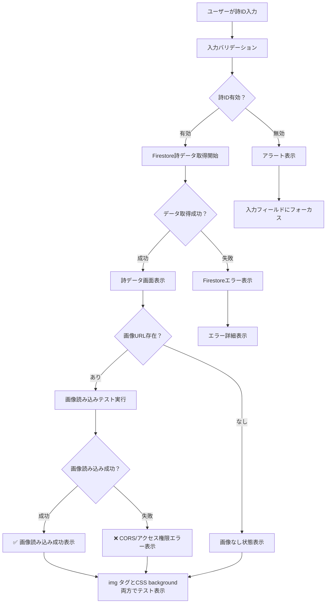

# Debug Page デザイン仕様書 (/debug)

## 概要

デバッグページは開発者向けのFirebase Storage システム調査とFirestore詩データ取得テストを行うページです。白背景のクリーンなデザインで、詳細な情報表示と結果の可視化に最適化されています。

## 目的・役割

🔧 **Firebase Storage システムの詳細調査**
- Storage bucket情報の確認
- Firebase SDK getBlob() 機能テスト
- CORS制限とアクセス権限の検証
- セキュリティルールの状態確認

🗃️ **Firestore詩データ取得テスト**
- 詩データの読み込み機能検証
- 画像URL読み込み状況の確認
- エラーケースの詳細表示

## 処理フロー

### Firebase Storage システム調査フロー

```mermaid
flowchart TD
    A[ユーザーがStorage調査開始ボタンクリック] --> B[Storage bucket情報取得]
    B --> C[Firebase SDK getBlob()テスト実行]
    C --> D{getBlob()成功？}
    D -->|成功| E[Object URL生成]
    D -->|失敗| F[エラー詳細記録]
    E --> G[images/ディレクトリ一覧取得]
    F --> G
    G --> H{ディレクトリアクセス成功？}
    H -->|成功| I[各ファイルのDownload URL取得]
    H -->|失敗| J[権限エラー記録]
    I --> K[CORS制限テスト実行]
    J --> L[調査結果まとめて表示]
    K --> M{CORS テスト成功？}
    M -->|成功| N[✅ 成功結果記録]
    M -->|失敗| O[❌ CORS エラー記録]
    N --> L
    O --> L
    L --> P[カラー分類で結果表示]
```

### Firestore詩データ取得テストフロー



## デザインシステム

### カラーパレット

```css
/* 背景 */
--bg-primary: #f9fafb        /* gray-50 */
--bg-card: #ffffff           /* 白背景 */

/* テキスト */
--text-primary: #1f2937      /* gray-800 */
--text-secondary: #4b5563    /* gray-600 */
--text-mono: monospace       /* ID表示用 */

/* ステータスカラー */
--success-bg: #f0fdf4        /* green-50 */
--success-border: #bbf7d0    /* green-200 */
--success-text: #166534      /* green-800 */

--error-bg: #fef2f2          /* red-50 */
--error-border: #fecaca      /* red-200 */
--error-text: #991b1b        /* red-800 */

--warning-bg: #fffbeb        /* yellow-50 */
--warning-border: #fde68a    /* yellow-200 */
--warning-text: #92400e      /* yellow-800 */

--info-bg: #eff6ff           /* blue-50 */
--info-border: #bfdbfe       /* blue-200 */
--info-text: #1e40af         /* blue-800 */

/* アクションボタン */
--btn-purple: #8b5cf6        /* purple-500 */
--btn-purple-hover: #7c3aed  /* purple-600 */
--btn-blue: #3b82f6          /* blue-500 */
--btn-blue-hover: #2563eb    /* blue-600 */
--btn-green: #10b981         /* green-500 */
--btn-green-hover: #059669   /* green-600 */
```

### レイアウト構造

```css
/* コンテナ */
.debug-container {
  min-height: 100vh;
  background: #f9fafb;
  padding: 2rem;
}

.debug-content {
  max-width: 64rem;  /* max-w-4xl */
  margin: 0 auto;
}

/* カードコンポーネント */
.debug-card {
  background: #ffffff;
  border-radius: 0.5rem;
  box-shadow: 0 1px 3px 0 rgba(0, 0, 0, 0.1);
  padding: 1.5rem;
  margin-bottom: 1.5rem;
}
```

## UIコンポーネント仕様

### 1. メインタイトル

```css
.debug-title {
  font-size: 1.875rem;       /* text-3xl */
  font-weight: 700;          /* font-bold */
  text-align: center;
  margin-bottom: 2rem;
  color: #1f2937;
}

.debug-title::before {
  content: "🔧 ";
}
```

### 2. Firebase Storage システム調査セクション

#### 調査ボタン
```css
.storage-debug-btn {
  background: #8b5cf6;
  color: white;
  padding: 0.5rem 1.5rem;
  border-radius: 0.375rem;
  border: none;
  cursor: pointer;
  transition: background-color 0.2s;
}

.storage-debug-btn:hover {
  background: #7c3aed;
}

.storage-debug-btn:disabled {
  background: #d1d5db;
  cursor: not-allowed;
}
```

#### 調査結果表示
```css
/* 成功状態 */
.result-success {
  background: #f0fdf4;
  border: 1px solid #bbf7d0;
  color: #166534;
  padding: 0.75rem;
  border-radius: 0.375rem;
  margin-bottom: 0.75rem;
}

/* エラー状態 */
.result-error {
  background: #fef2f2;
  border: 1px solid #fecaca;
  color: #991b1b;
  padding: 0.75rem;
  border-radius: 0.375rem;
  margin-bottom: 0.75rem;
}

/* 警告状態 */
.result-warning {
  background: #fffbeb;
  border: 1px solid #fde68a;
  color: #92400e;
  padding: 0.75rem;
  border-radius: 0.375rem;
  margin-bottom: 0.75rem;
}

/* 情報状態 */
.result-info {
  background: #eff6ff;
  border: 1px solid #bfdbfe;
  color: #1e40af;
  padding: 0.75rem;
  border-radius: 0.375rem;
  margin-bottom: 0.75rem;
}
```

#### アイコンシステム
```css
.result-icon {
  margin-right: 0.5rem;
  font-weight: 500;
}

/* アイコンマッピング */
.result-success .result-icon::before { content: "✅"; }
.result-error .result-icon::before { content: "❌"; }
.result-warning .result-icon::before { content: "⚠️"; }
.result-info .result-icon::before { content: "ℹ️"; }
```

### 3. 詩データ取得テストセクション

#### 入力フィールド
```css
.poem-input {
  flex: 1;
  padding: 0.5rem 0.75rem;
  border: 1px solid #d1d5db;
  border-radius: 0.375rem;
  outline: none;
  transition: all 0.2s;
}

.poem-input:focus {
  ring: 2px solid #3b82f6;
  border-color: #3b82f6;
}

.poem-input:disabled {
  background: #f3f4f6;
  cursor: not-allowed;
}
```

#### テストボタン
```css
.test-execute-btn {
  background: #3b82f6;
  color: white;
  padding: 0.5rem 1.5rem;
  border-radius: 0.375rem;
  border: none;
  cursor: pointer;
  transition: background-color 0.2s;
}

.test-execute-btn:hover {
  background: #2563eb;
}

.test-execute-btn:disabled {
  background: #d1d5db;
  cursor: not-allowed;
}
```

### 4. 詩データ表示セクション

#### データ項目レイアウト
```css
.poem-data-item {
  margin-bottom: 1rem;
}

.poem-data-label {
  font-weight: 500;
  margin-bottom: 0.25rem;
  color: #374151;
}

.poem-data-value {
  color: #1f2937;
}

.poem-data-id {
  font-family: monospace;
  font-size: 0.875rem;
  color: #4b5563;
}

.poem-data-phrase {
  background: #f9fafb;
  padding: 0.75rem;
  border-radius: 0.375rem;
  white-space: pre-line;
}
```

#### 画像URL操作ボタン
```css
.image-action-btn {
  padding: 0.25rem 0.75rem;
  border-radius: 0.25rem;
  border: none;
  font-size: 0.875rem;
  cursor: pointer;
  transition: background-color 0.2s;
  margin-left: 0.5rem;
}

.direct-open-btn {
  background: #10b981;
  color: white;
}

.direct-open-btn:hover {
  background: #059669;
}

.retest-btn {
  background: #3b82f6;
  color: white;
}

.retest-btn:hover {
  background: #2563eb;
}
```

### 5. 画像表示テストセクション

#### テスト画像表示
```css
.test-image {
  max-width: 28rem;  /* max-w-md */
  border-radius: 0.375rem;
  border: 1px solid #e5e7eb;
}

.test-image-bg {
  width: 20rem;      /* w-80 */
  height: 12rem;     /* h-48 */
  border-radius: 0.375rem;
  border: 1px solid #e5e7eb;
  background-size: cover;
  background-position: center;
}
```

## 機能仕様

### Firebase Storage 調査機能

1. **Storage Bucket 情報確認**
   - アプリID とStorage bucket名の表示
   - 設定の正常性確認

2. **Firebase SDK getBlob() テスト**
   - 実在する画像IDでのテスト実行
   - Object URL作成とクリーンアップ
   - サイズとタイプ情報の表示

3. **ディレクトリアクセステスト**
   - images/ ディレクトリの一覧取得
   - ファイルのダウンロードURL取得
   - CORS制限の検証

4. **画像読み込み検証**
   - HTTP HEADリクエストテスト
   - Image オブジェクトでの読み込みテスト
   - タイムアウト制御

### 詩データ取得機能

1. **Firestore読み込み**
   - 詩IDによるデータ取得
   - エラーハンドリング
   - データ構造の確認

2. **画像読み込みテスト**
   - 画像URLの有効性確認
   - CORS問題の検出
   - クロスオリジン設定の確認

## パフォーマンス考慮事項

### 読み込み最適化
- Object URLの適切なクリーンアップ（5秒後）
- 画像読み込みタイムアウト設定（5秒）
- HTTP HEADリクエストでの軽量チェック

### メモリ管理
- テスト結果の適切な初期化
- 不要なリスナーの除去
- 大容量データの分割表示

## アクセシビリティ

### セマンティック構造
```html
<main role="main">
  <section aria-labelledby="storage-debug">
    <h2 id="storage-debug">Firebase Storage システム調査</h2>
    <!-- 調査機能 -->
  </section>
  
  <section aria-labelledby="poem-test">
    <h2 id="poem-test">詩データ取得テスト</h2>
    <!-- テスト機能 -->
  </section>
</main>
```

### フォーカス管理
- キーボードナビゲーション対応
- ボタンの適切なフォーカス状態
- 無効状態の明確な表示

### 状態通知
- スクリーンリーダー対応のアリア属性
- 読み込み状態の音声通知
- エラー状態の明確な伝達

## レスポンシブデザイン

### モバイル（~768px）
- カード要素のフルwidth表示
- ボタンの縦並び配置
- フォントサイズの調整

### タブレット（768px~）
- 2カラムレイアウトの部分採用
- ボタンの横並び配置
- パディングの最適化

### デスクトップ（1024px~）
- 最大幅制限（max-w-4xl）
- 効率的な情報密度
- ホバー効果の活用

## エラーハンドリング

### Firebase関連エラー
- 権限エラーの詳細表示
- セキュリティルール設定ガイド
- 代替手段の提案

### ネットワークエラー
- タイムアウト設定
- リトライ機能
- オフライン状態の検出

## 開発者向け機能

### デバッグ情報
- コンソールログの詳細出力
- パフォーマンス測定結果
- Firebase SDK バージョン情報

### テストカバレッジ
- 成功ケースの網羅的テスト
- 失敗ケースの意図的生成
- エッジケースの検証

---

**更新履歴**
- 2025-07-13: 初版作成
- Firebase Storage調査機能とFirestore詩データテスト機能の仕様文書化