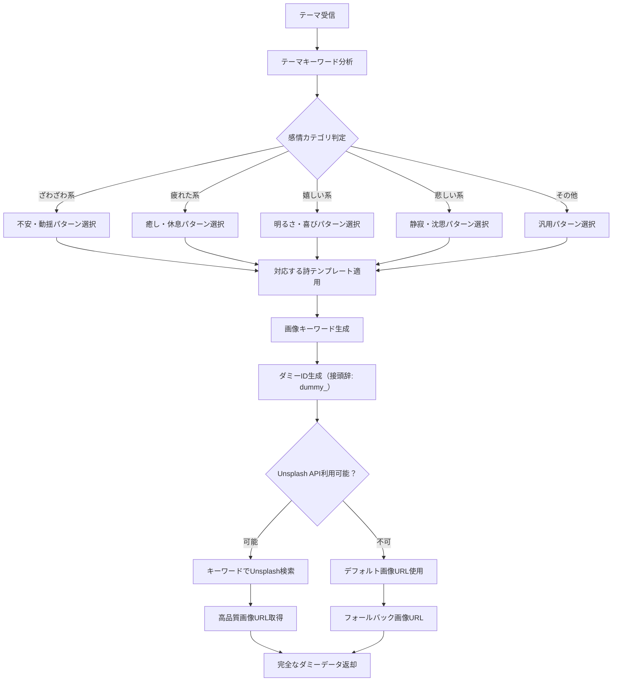

# Test Dummy Page デザイン仕様書 (/test-dummy)

## 概要

ダミーAPIテストページは、OpenAI API制限時やオフライン開発時の代替テスト環境として機能します。実際のAI生成の代わりに事前定義されたダミーデータを使用し、フロントエンド機能とFirebase連携をテストできます。

## 目的・役割

🎭 **OpenAI API制限時の代替テスト**
- API制限やコスト節約時の開発継続
- 事前定義されたダミー詩データの活用
- Unsplash画像を代用した視覚確認

🔄 **フロントエンド機能検証**
- UI/UXの動作確認
- Firebase Firestoreとの連携テスト
- 詩ページ遷移の確認

## 処理フロー

### ダミーAPI テスト処理フロー

```mermaid
flowchart TD
    A[ユーザーがテーマ入力] --> B[入力バリデーション]
    B --> C{テーマ有効？}
    C -->|空文字| D[アラート表示: テーマを入力してください]
    C -->|有効| E[ボタン無効化・ローディング開始]
    E --> F[/api/generate-dummy エンドポイント呼び出し]
    F --> G[事前定義済みダミー詩パターン選択]
    G --> H[テーマに基づくキーワード抽出]
    H --> I[Unsplash API呼び出し]
    I --> J{Unsplash画像取得成功？}
    J -->|失敗| K[デフォルト画像URL使用]
    J -->|成功| L[Unsplash画像URL取得]
    K --> M[ダミーデータ作成]
    L --> M
    M --> N[isDummy: true フラグ設定]
    N --> O[Firestore保存（ダミーデータ）]
    O --> P[生成結果表示（ダミーバッジ付き）]
    P --> Q[詩ページ遷移リンク表示]
    Q --> R[ローディング終了]
    D --> S[入力フィールドにフォーカス]
```

### ダミーデータ生成ロジック



## デザインシステム

### カラーパレット

```css
/* 背景 */
--bg-primary: #f9fafb        /* gray-50 */
--bg-card: #ffffff           /* 白背景 */

/* テキスト */
--text-primary: #1f2937      /* gray-800 */
--text-secondary: #4b5563    /* gray-600 */
--text-label: #374151        /* gray-700 */

/* フォーム要素（基本テストページと同一） */
--input-border: #d1d5db      /* gray-300 */
--input-focus: #ec4899       /* pink-500 */
--btn-primary: #ec4899       /* pink-500 */
--btn-primary-hover: #db2777 /* pink-600 */

/* ダミー識別用カラー */
--dummy-bg: #fffbeb          /* yellow-50 */
--dummy-border: #fde68a      /* yellow-200 */
--dummy-text: #92400e        /* yellow-800 */

/* アクションボタン */
--btn-secondary: #3b82f6     /* blue-500 */
--btn-secondary-hover: #2563eb /* blue-600 */
```

### レイアウト構造

```css
/* ベースレイアウト（基本テストページと同一） */
.test-dummy-container {
  min-height: 100vh;
  background: #f9fafb;
  padding: 2rem;
}

.test-dummy-content {
  max-width: 42rem;  /* max-w-2xl */
  margin: 0 auto;
}
```

## UIコンポーネント仕様

### 1. メインタイトル・説明

```css
.dummy-title-container {
  text-align: center;
  margin-bottom: 2rem;
}

.dummy-title {
  font-size: 1.875rem;       /* text-3xl */
  font-weight: 700;          /* font-bold */
  margin-bottom: 0.5rem;
  color: #1f2937;
}

.dummy-title::before {
  content: "🎭 ";
}

.dummy-subtitle {
  color: #4b5563;            /* gray-600 */
  font-size: 1rem;
}
```

### 2. ダミーデータ識別バッジ

```css
.dummy-badge {
  background: #fffbeb;       /* yellow-50 */
  color: #92400e;            /* yellow-800 */
  font-size: 0.75rem;        /* text-xs */
  padding: 0.25rem 0.5rem;
  border-radius: 9999px;     /* rounded-full */
  margin-left: 0.75rem;
  display: inline-flex;
  align-items: center;
}

.dummy-badge::before {
  content: "ダミーデータ";
}
```

### 3. 入力フォーム（基本版と同一仕様）

```css
/* test-page-design.mdと同様の仕様を継承 */
.theme-input {
  width: 100%;
  padding: 0.5rem 0.75rem;
  border: 1px solid #d1d5db;
  border-radius: 0.375rem;
  outline: none;
  transition: all 0.2s;
}

.generate-btn {
  width: 100%;
  background: #ec4899;
  color: white;
  padding: 0.5rem 1rem;
  border-radius: 0.375rem;
  border: none;
  cursor: pointer;
  transition: background-color 0.2s;
}

.generate-btn-text::after {
  content: " ✨";
}

.generate-btn-loading::after {
  content: " 🎭";  /* ダミー版独自のアイコン */
}
```

### 4. 結果表示セクション

#### メインコンテナ（ダミーバッジ付き）
```css
.dummy-result-container {
  background: #ffffff;
  border-radius: 0.5rem;
  box-shadow: 0 1px 3px 0 rgba(0, 0, 0, 0.1);
  padding: 1.5rem;
}

.dummy-result-header {
  display: flex;
  align-items: center;
  margin-bottom: 1rem;
}

.dummy-result-title {
  font-size: 1.25rem;        /* text-xl */
  font-weight: 700;          /* font-bold */
  color: #1f2937;
}

.dummy-result-title::before {
  content: "🎉 ";
}
```

#### ダミー画像表示（Unsplash）

```css
.dummy-image-section {
  margin-bottom: 1rem;
}

.dummy-image-label {
  font-weight: 500;
  color: #374151;
  margin-bottom: 0.25rem;
}

.dummy-image-label::after {
  content: "（Unsplash）";
  color: #6b7280;
  font-weight: 400;
  font-size: 0.875rem;
}

.dummy-image {
  width: 100%;
  max-width: 28rem;          /* max-w-md */
  border-radius: 0.375rem;
  margin-top: 0.5rem;
  border: 1px solid #e5e7eb;
}
```

## 機能仕様

### ダミーデータ生成

1. **API エンドポイント**
   - `/api/generate-dummy` を呼び出し
   - 実際のOpenAI APIは使用しない
   - 事前定義された詩パターンから選択

2. **ダミー詩データ構造**
   ```javascript
   const dummyPoems = [
     {
       pattern: "ざわざわ",
       phrase: "心の中で\nざわめく風が\nそっと通り過ぎる",
       imageKeywords: "peaceful, wind, nature"
     },
     {
       pattern: "疲れた",
       phrase: "肩の重みを\n夕日が包んで\n優しく溶かしてく",
       imageKeywords: "sunset, rest, warm"
     }
     // 他のパターン...
   ];
   ```

3. **Unsplash画像取得**
   - テーマに基づいたキーワードでUnsplash API呼び出し
   - 商用利用可能な高品質画像
   - DALL-E生成画像の代替として使用

### レスポンスデータ構造

#### 送信データ
```json
{
  "theme": "ざわざわした気分"
}
```

#### 受信データ（成功時）
```json
{
  "success": true,
  "data": {
    "id": "dummy_koYZvp3rup_2QuyzOw2PA",
    "theme": "ざわざわした気分",
    "phrase": "心の中で\nざわめく風が\nそっと通り過ぎる",
    "imageUrl": "https://images.unsplash.com/photo-...",
    "imagePrompt": "peaceful wind in nature, soft lighting",
    "isDummy": true,
    "note": "これはダミーデータです。実際のAI生成とは異なります。"
  }
}
```

### 状態管理（基本版と同一）

```javascript
const [theme, setTheme] = useState('');
const [loading, setLoading] = useState(false);
const [result, setResult] = useState(null);
const [error, setError] = useState(null);
```

## インタラクション設計

### ユーザーフロー

1. **説明認識**
   - ページタイトルとサブタイトルでダミー版であることを明示
   - OpenAI API制限時の代替であることを説明

2. **テスト実行**
   - 基本版と同様の操作感
   - ダミーデータ生成の高速レスポンス
   - 結果にダミーバッジ表示

3. **結果確認**
   - ダミー詩の表示
   - Unsplash画像の表示
   - 詩ページへの遷移（ダミーデータ保存済み）

### ダミーデータの特徴

```css
/* ダミー識別要素 */
.dummy-indicator {
  background: linear-gradient(45deg, #fffbeb, #fef3c7);
  border-left: 4px solid #f59e0b;
  padding: 0.5rem;
  margin: 0.5rem 0;
  border-radius: 0.25rem;
}

.dummy-note {
  font-size: 0.75rem;
  color: #3b82f6;
  font-style: italic;
  margin-top: 0.5rem;
}
```

## アクセシビリティ

### ダミーデータの明確な識別

```html
<section aria-labelledby="dummy-result" role="region">
  <div class="dummy-result-header">
    <h2 id="dummy-result">生成結果</h2>
    <span class="dummy-badge" role="status" aria-label="ダミーデータ使用中">
      ダミーデータ
    </span>
  </div>
  
  <div class="dummy-note" role="note">
    これはダミーデータです。実際のAI生成とは異なります。
  </div>
</section>
```

### スクリーンリーダー対応
- ダミーデータであることの音声通知
- 代替テキストの適切な設定
- 機能制限の明確な説明

## レスポンシブデザイン

### 基本テストページと同一仕様
- モバイル対応レイアウト
- タブレット・デスクトップ最適化
- ダミーバッジの適切な配置

## パフォーマンス考慮事項

### 高速レスポンス
- API呼び出しなしでの即座のレスポンス
- Unsplash画像のキャッシュ活用
- 軽量なダミーデータ生成

### メモリ効率
- 事前定義パターンの効率的な選択
- 不要な画像プリロードの回避

## 開発・テスト価値

### 開発継続性
- OpenAI API制限時の開発継続
- コスト制御下でのUI/UXテスト
- チーム開発での共通テストデータ

### 機能検証
- Firebase Firestore連携の確認
- ページ遷移フローの検証
- エラーハンドリングの動作確認

### デモンストレーション
- API制限のない状況でのデモ実行
- 安定したテスト環境の提供
- 見込み顧客への機能紹介

## 今後の拡張可能性

### ダミーデータの充実
- より多様な詩パターンの追加
- テーマ別のカテゴリ分類
- 季節や時間帯に応じた内容変更

### 設定機能
- ダミーモードの明示的な切り替え
- カスタムダミーデータの追加
- テスト用パラメータの調整

### 分析機能
- ダミーテストの実行回数記録
- よく使用されるテーマの分析
- 実データとの比較メトリクス

---

**更新履歴**
- 2025-07-13: 初版作成
- ダミーAPI代替テスト機能の仕様文書化