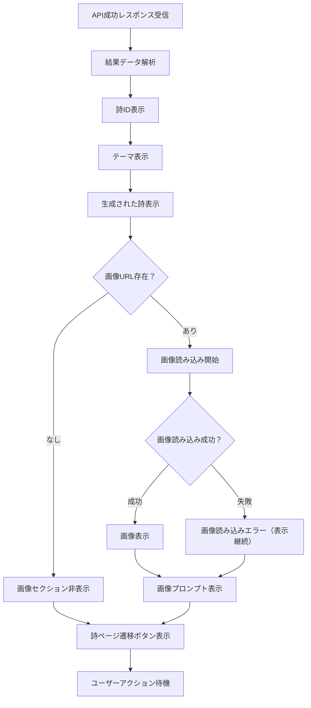

# Test Page デザイン仕様書 (/test)

## 概要

基本的なAPIテストページで、OpenAI APIとFirebase連携の実装をテストするためのシンプルな開発者向けインターフェースです。白背景の清潔なデザインで、API呼び出しの結果を詳細に表示します。

## 目的・役割

🌸 **OpenAI API 基本機能テスト**
- GPT-4oによる詩生成のテスト
- DALL-E 3による画像生成のテスト
- Firebase Firestoreへのデータ保存確認

📊 **開発・デバッグ支援**
- API呼び出しの成功/失敗確認
- 生成結果の詳細表示
- 詩ページへの遷移確認

## 処理フロー

### OpenAI API テスト処理フロー

```mermaid
flowchart TD
    A[ユーザーがテーマ入力] --> B[入力バリデーション]
    B --> C{テーマ有効？}
    C -->|空文字| D[アラート表示: テーマを入力してください]
    C -->|有効| E[ボタン無効化・ローディング開始]
    E --> F[/api/generate エンドポイント呼び出し]
    F --> G[GPT-4o詩生成 + DALL-E画像生成並列実行]
    G --> H{API呼び出し成功？}
    H -->|失敗| I[エラー状態設定]
    H -->|成功| J{レスポンス.success確認}
    J -->|false| K[APIエラーメッセージ表示]
    J -->|true| L[Firestore保存完了]
    L --> M[生成結果表示]
    M --> N[詩ページ遷移リンク表示]
    I --> O[ネットワークエラー表示]
    K --> P[ローディング終了]
    O --> P
    N --> P
    D --> Q[入力フィールドにフォーカス]
```

### 生成結果表示フロー



## デザインシステム

テストページのデザインは、統一されたデザインシステムに基づいています。

詳細なカラーパレット、タイポグラフィ、コンポーネントスタイルについては、[デザインシステム](design-system.md) を参照してください。

## UIコンポーネント仕様

### 1. メインタイトル

```css
.test-title {
  font-size: 1.875rem;       /* text-3xl */
  font-weight: 700;          /* font-bold */
  text-align: center;
  margin-bottom: 2rem;
  color: #1f2937;
}

.test-title::before {
  content: "🌸 ";
}
```

### 2. 入力フォームセクション

#### フォームレイアウト
```css
.input-section {
  background: #ffffff;
  border-radius: 0.5rem;
  box-shadow: 0 1px 3px 0 rgba(0, 0, 0, 0.1);
  padding: 1.5rem;
  margin-bottom: 1.5rem;
}

.input-group {
  margin-bottom: 1rem;
}

.input-label {
  display: block;
  font-size: 0.875rem;       /* text-sm */
  font-weight: 500;          /* font-medium */
  color: #374151;            /* gray-700 */
  margin-bottom: 0.5rem;
}
```

#### テーマ入力フィールド
```css
.theme-input {
  width: 100%;
  padding: 0.5rem 0.75rem;
  border: 1px solid #d1d5db;
  border-radius: 0.375rem;
  outline: none;
  transition: all 0.2s;
  font-size: 1rem;
}

.theme-input:focus {
  outline: none;
  ring: 2px solid #ec4899;
  border-color: #ec4899;
}

.theme-input:disabled {
  background: #f3f4f6;
  cursor: not-allowed;
}

.theme-input::placeholder {
  color: #9ca3af;
}
```

#### 生成ボタン
```css
.generate-btn {
  width: 100%;
  background: #ec4899;
  color: white;
  padding: 0.5rem 1rem;
  border-radius: 0.375rem;
  border: none;
  cursor: pointer;
  transition: background-color 0.2s;
  font-weight: 500;
  display: flex;
  align-items: center;
  justify-content: center;
}

.generate-btn:hover:not(:disabled) {
  background: #db2777;
}

.generate-btn:disabled {
  background: #d1d5db;
  cursor: not-allowed;
}

.generate-btn-text::after {
  content: " ✨";
  margin-left: 0.5rem;
}

.generate-btn-loading::after {
  content: " ⏰";
  margin-left: 0.5rem;
}
```

### 3. エラー表示セクション

```css
.error-display {
  background: #fef2f2;
  border: 1px solid #fecaca;
  border-radius: 0.5rem;
  padding: 1rem;
  margin-bottom: 1.5rem;
}

.error-title {
  color: #991b1b;
  font-weight: 500;
  margin-bottom: 0.25rem;
}

.error-message {
  color: #dc2626;
  font-size: 0.875rem;
}
```

### 4. 結果表示セクション

#### メインコンテナ
```css
.result-container {
  background: #ffffff;
  border-radius: 0.5rem;
  box-shadow: 0 1px 3px 0 rgba(0, 0, 0, 0.1);
  padding: 1.5rem;
}

.result-title {
  font-size: 1.25rem;        /* text-xl */
  font-weight: 700;          /* font-bold */
  margin-bottom: 1rem;
  color: #1f2937;
}

.result-title::before {
  content: "🎉 ";
}
```

#### データ項目表示
```css
.result-item {
  margin-bottom: 1rem;
}

.result-label {
  font-weight: 500;
  color: #374151;
  margin-bottom: 0.25rem;
}

.result-value {
  color: #1f2937;
}

.result-id {
  font-family: monospace;
  font-size: 0.875rem;
  color: #4b5563;
}

.result-theme {
  color: #1f2937;
  font-size: 1rem;
}
```

#### 詩表示エリア
```css
.poem-display {
  background: #f9fafb;
  padding: 1rem;
  border-radius: 0.375rem;
  margin-top: 0.5rem;
}

.poem-text {
  color: #1f2937;
  white-space: pre-line;
  line-height: 1.6;
  font-size: 1rem;
}
```

#### 生成画像表示
```css
.generated-image {
  width: 100%;
  max-width: 28rem;          /* max-w-md */
  border-radius: 0.375rem;
  margin-top: 0.5rem;
  border: 1px solid #e5e7eb;
}
```

#### 画像プロンプト表示
```css
.image-prompt {
  font-size: 0.875rem;
  color: #4b5563;
  line-height: 1.5;
}
```

### 5. アクションボタン

```css
.view-poem-btn {
  display: inline-block;
  background: #3b82f6;
  color: white;
  padding: 0.5rem 1rem;
  border-radius: 0.375rem;
  text-decoration: none;
  transition: background-color 0.2s;
  margin-top: 1.5rem;
}

.view-poem-btn:hover {
  background: #2563eb;
}

.view-poem-btn::after {
  content: " →";
  margin-left: 0.5rem;
}
```

## 機能仕様

### API呼び出し処理

1. **入力検証**
   - テーマの空文字チェック
   - trim()による前後空白削除
   - 最大文字数制限（暗黙的）

2. **API通信**
   - `/api/generate` エンドポイントへのPOST
   - Content-Type: application/json
   - タイムアウト制御

3. **レスポンス処理**
   - 成功時: 結果表示とページ遷移リンク
   - 失敗時: エラーメッセージ表示
   - ネットワークエラーの適切な処理

### 状態管理

```javascript
// 状態変数
const [theme, setTheme] = useState('');          // 入力テーマ
const [loading, setLoading] = useState(false);   // 読み込み状態
const [result, setResult] = useState(null);      // 生成結果
const [error, setError] = useState(null);        // エラー状態
```

### データ構造

#### 送信データ
```json
{
  "theme": "ざわざわした気分"
}
```

#### 受信データ（成功時）
```json
{
  "success": true,
  "data": {
    "id": "koYZvp3rup_2QuyzOw2PA",
    "theme": "ざわざわした気分",
    "phrase": "生成された詩の内容",
    "imageUrl": "https://firebasestorage.googleapis.com/...",
    "imagePrompt": "DALL-E用のプロンプト"
  }
}
```

#### 受信データ（失敗時）
```json
{
  "success": false,
  "error": "エラーメッセージ"
}
```

## インタラクション設計

### ユーザーフロー

1. **入力段階**
   - テーマ入力フィールドにフォーカス
   - プレースホルダーテキストでガイダンス
   - Enterキー対応（未実装）

2. **実行段階**
   - ボタン無効化
   - ローディング表示
   - エラーハンドリング

3. **結果段階**
   - 生成結果の段階的表示
   - 詩ページへの遷移リンク
   - 新しいテスト実行の準備

### アニメーション

```css
/* ボタンホバー効果 */
.interactive-element {
  transition: all 0.2s ease-in-out;
}

/* ローディング状態 */
.loading-text {
  opacity: 0.8;
}

/* 結果表示のフェードイン */
.result-appear {
  animation: fadeIn 0.5s ease-in-out;
}

@keyframes fadeIn {
  from { opacity: 0; transform: translateY(10px); }
  to { opacity: 1; transform: translateY(0); }
}
```

## アクセシビリティ

### セマンティック構造
```html
<main role="main">
  <h1>API テストページ</h1>
  
  <form aria-labelledby="input-section">
    <fieldset>
      <legend>詩生成設定</legend>
      <label for="theme-input">テーマを入力してください</label>
      <input id="theme-input" type="text" required />
      <button type="submit">詩を生成する</button>
    </fieldset>
  </form>
  
  <section aria-labelledby="result-section" aria-live="polite">
    <h2 id="result-section">生成結果</h2>
    <!-- 結果表示 -->
  </section>
</main>
```

### フォーカス管理
- 入力フィールドの適切なフォーカス順序
- ボタンの無効状態での明確な視覚表現
- エラー発生時のフォーカス管理

### スクリーンリーダー対応
- aria-live="polite" による状態変更通知
- 適切なラベル付け
- エラーメッセージの関連付け

## レスポンシブデザイン

### モバイル（~640px）
- コンテナの最大幅調整
- パディングの最適化
- ボタンのタップ領域確保

### タブレット（640px~）
- レイアウトの安定化
- 読みやすい行長の維持

### デスクトップ（768px~）
- 最大幅制限（max-w-2xl）
- ホバー効果の活用
- 効率的なスペース活用

## パフォーマンス考慮事項

### 最適化ポイント
- API呼び出し中の重複リクエスト防止
- 画像の遅延読み込み
- 不要な再レンダリングの抑制

### エラーハンドリング
- ネットワークタイムアウトの適切な設定
- ユーザーフレンドリーなエラーメッセージ
- リトライ機能の検討

## 今後の拡張可能性

### 機能追加案
- Enterキーでの送信対応
- 履歴機能
- より詳細なプログレス表示
- バッチテスト機能

### UI改善案
- よりリッチなローディングアニメーション
- リアルタイム入力文字数カウント
- テーマのサジェスト機能

---

**更新履歴**
- 2025-07-13: 初版作成
- OpenAI API基本テスト機能の仕様文書化