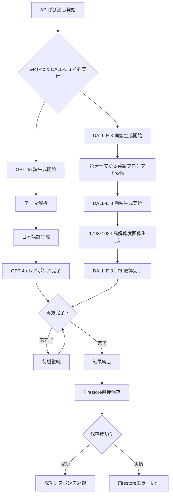
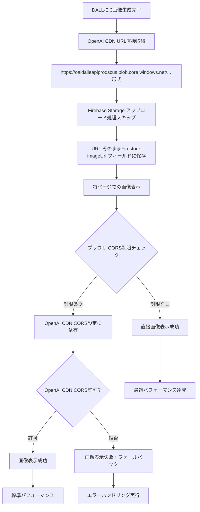

# Test Simple Page デザイン仕様書 (/test-simple)

## 概要

Firebase Storage回避版のOpenAI APIテストページです。DALL-E生成画像のURLを直接Firestoreに保存し、Firebase Storage制限を回避してリアルなAI生成機能をテストできます。基本テストページと同様の白背景デザインを採用しています。

## 目的・役割

🌸 **Firebase Storage回避版 OpenAI API テスト**
- DALL-E 3による画像生成とURL直接保存
- Firebase Storage制限下でのAI機能確認
- OpenAI APIの実動作テスト

⚡ **パフォーマンス最適化テスト**
- Firebase Storage中間処理の回避
- DALL-E URLの直接利用による高速化
- ネットワーク効率の改善

## 処理フロー

### Firebase Storage回避版 OpenAI API テスト処理フロー

```mermaid
flowchart TD
    A[ユーザーがテーマ入力] --> B[入力バリデーション]
    B --> C{テーマ有効？}
    C -->|空文字| D[アラート表示: テーマを入力してください]
    C -->|有効| E[ボタン無効化・ローディング開始]
    E --> F[/api/generate-safe エンドポイント呼び出し]
    F --> G[OpenAI GPT-4o 詩生成開始]
    G --> H[OpenAI DALL-E 3 画像生成並列実行]
    H --> I{OpenAI API呼び出し成功？}
    I -->|失敗| J[OpenAI APIエラー処理]
    I -->|成功| K[GPT-4o生成詩取得]
    K --> L[DALL-E 3生成画像URL直接取得]
    L --> M[Firebase Storage処理スキップ]
    M --> N[DALL-E URL そのままFirestore保存]
    N --> O[生成結果表示（OpenAIバッジ付き）]
    O --> P[詩ページ遷移リンク表示]
    P --> Q[ローディング終了]
    J --> R[エラーメッセージ表示]
    R --> Q
    D --> S[入力フィールドにフォーカス]
```

### OpenAI API 並列処理フロー



### CORS制限回避メカニズム



## デザインシステム

### カラーパレット

```css
/* 背景（基本テストページと同一） */
--bg-primary: #f9fafb        /* gray-50 */
--bg-card: #ffffff           /* 白背景 */

/* テキスト */
--text-primary: #1f2937      /* gray-800 */
--text-secondary: #4b5563    /* gray-600 */
--text-label: #374151        /* gray-700 */

/* フォーム要素 */
--input-border: #d1d5db      /* gray-300 */
--input-focus: #ec4899       /* pink-500 */
--btn-primary: #ec4899       /* pink-500 */
--btn-primary-hover: #db2777 /* pink-600 */

/* OpenAI識別カラー */
--openai-bg: #f0fdf4         /* green-50 */
--openai-border: #bbf7d0     /* green-200 */
--openai-text: #166534       /* green-800 */

/* アクションボタン */
--btn-secondary: #3b82f6     /* blue-500 */
--btn-secondary-hover: #2563eb /* blue-600 */
```

### レイアウト構造

```css
/* ベースレイアウト（基本テストページと同一） */
.test-simple-container {
  min-height: 100vh;
  background: #f9fafb;
  padding: 2rem;
}

.test-simple-content {
  max-width: 42rem;  /* max-w-2xl */
  margin: 0 auto;
}
```

## UIコンポーネント仕様

### 1. メインタイトル・説明

```css
.simple-title-container {
  text-align: center;
  margin-bottom: 2rem;
}

.simple-title {
  font-size: 1.875rem;       /* text-3xl */
  font-weight: 700;          /* font-bold */
  margin-bottom: 0.5rem;
  color: #1f2937;
}

.simple-title::before {
  content: "🌸 ";
}

.simple-subtitle {
  color: #4b5563;            /* gray-600 */
  font-size: 1rem;
  line-height: 1.5;
}
```

### 2. OpenAI識別バッジ

```css
.openai-badge {
  background: #f0fdf4;       /* green-50 */
  color: #166534;            /* green-800 */
  font-size: 0.75rem;        /* text-xs */
  padding: 0.25rem 0.5rem;
  border-radius: 9999px;     /* rounded-full */
  margin-left: 0.75rem;
  display: inline-flex;
  align-items: center;
  border: 1px solid #bbf7d0; /* green-200 */
}

.openai-badge::before {
  content: "OpenAI API";
}
```

### 3. 入力フォーム（基本版と同一仕様）

```css
/* test-page-design.mdと同様の仕様を継承 */
.theme-input {
  width: 100%;
  padding: 0.5rem 0.75rem;
  border: 1px solid #d1d5db;
  border-radius: 0.375rem;
  outline: none;
  transition: all 0.2s;
}

.theme-input:focus {
  ring: 2px solid #ec4899;
  border-color: #ec4899;
}

.generate-btn {
  width: 100%;
  background: #ec4899;
  color: white;
  padding: 0.5rem 1rem;
  border-radius: 0.375rem;
  border: none;
  cursor: pointer;
  transition: background-color 0.2s;
}

.generate-btn-text::after {
  content: " ✨";
}

.generate-btn-loading::after {
  content: " ⏰";
}
```

### 4. 結果表示セクション

#### メインコンテナ（OpenAIバッジ付き）
```css
.simple-result-container {
  background: #ffffff;
  border-radius: 0.5rem;
  box-shadow: 0 1px 3px 0 rgba(0, 0, 0, 0.1);
  padding: 1.5rem;
}

.simple-result-header {
  display: flex;
  align-items: center;
  margin-bottom: 1rem;
}

.simple-result-title {
  font-size: 1.25rem;        /* text-xl */
  font-weight: 700;          /* font-bold */
  color: #1f2937;
}

.simple-result-title::before {
  content: "🎉 ";
}
```

#### AI生成詩表示（強調スタイル）

```css
.ai-poem-section {
  margin-bottom: 1rem;
}

.ai-poem-label {
  font-weight: 500;
  color: #374151;
  margin-bottom: 0.25rem;
}

.ai-poem-display {
  background: #f9fafb;
  padding: 1rem;
  border-radius: 0.375rem;
  margin-top: 0.5rem;
}

.ai-poem-text {
  color: #1f2937;
  white-space: pre-line;
  font-weight: 500;          /* font-medium */
  font-size: 1.125rem;       /* text-lg */
  line-height: 1.6;
}
```

#### DALL-E画像表示

```css
.dalle-image-section {
  margin-bottom: 1rem;
}

.dalle-image-label {
  font-weight: 500;
  color: #374151;
  margin-bottom: 0.25rem;
}

.dalle-image-label::after {
  content: ":";
}

.dalle-image {
  width: 100%;
  max-width: 28rem;          /* max-w-md */
  border-radius: 0.375rem;
  margin-top: 0.5rem;
  border: 1px solid #e5e7eb;
  box-shadow: 0 4px 6px -1px rgba(0, 0, 0, 0.1);
}
```

#### 注記表示

```css
.simple-note {
  font-size: 0.75rem;        /* text-xs */
  color: #3b82f6;            /* blue-600 */
  margin-top: 0.5rem;
  font-style: italic;
}
```

## 機能仕様

### API通信

1. **エンドポイント**
   - `/api/generate-safe` を呼び出し
   - Firebase Storage回避版の実装
   - OpenAI API直接利用

2. **処理フロー**
   ```
   ユーザー入力 ▶ GPT-4o詩生成 ▶ DALL-E画像生成 ▶ 
   Firestore保存（画像URLそのまま） ▶ 詩ページ表示
   ```

3. **Firebase Storage制限回避**
   - DALL-E生成画像URLの直接保存
   - 中間ストレージ処理のスキップ
   - CORS制限の根本的回避

### レスポンスデータ構造

#### 送信データ
```json
{
  "theme": "ざわざわした気分"
}
```

#### 受信データ（成功時）
```json
{
  "success": true,
  "data": {
    "id": "safe_koYZvp3rup_2QuyzOw2PA",
    "theme": "ざわざわした気分",
    "phrase": "AI生成の詩内容\n複数行対応",
    "imageUrl": "https://oaidalleapiprodscus.blob.core.windows.net/...",
    "imagePrompt": "detailed DALL-E prompt for the image",
    "note": "Firebase Storage回避版 - DALL-E URL直接保存"
  }
}
```

### 状態管理（基本版と同一）

```javascript
const [theme, setTheme] = useState('');
const [loading, setLoading] = useState(false);
const [result, setResult] = useState(null);
const [error, setError] = useState(null);
```

## インタラクション設計

### ユーザーフロー

1. **説明認識**
   - ページタイトルでFirebase Storage回避版であることを明示
   - リアルAI生成機能の利用であることを強調

2. **テスト実行**
   - 基本版と同様の操作感
   - OpenAI API実行による実際の生成時間
   - 生成品質の確認

3. **結果確認**
   - AI生成詩の表示（強調スタイル）
   - DALL-E画像の高品質表示
   - 詩ページへの遷移

### リアルタイム生成の特徴

```css
/* リアルタイム生成中の表示 */
.realtime-generation {
  background: linear-gradient(45deg, #f3f4f6, #e5e7eb);
  animation: pulse 2s infinite;
}

.generation-note {
  font-size: 0.875rem;
  color: #059669;
  font-weight: 500;
  margin-top: 0.5rem;
}

.generation-note::before {
  content: "⚡ ";
}
```

## パフォーマンス仕様

### 生成時間

1. **GPT-4o処理**
   - 通常3-8秒程度
   - 詩の品質とテーマ一致度の向上

2. **DALL-E 3処理**
   - 通常10-20秒程度
   - 高解像度画像の直接取得

3. **Firestore保存**
   - 1秒未満
   - シンプルなURL保存処理

### メモリ効率

- Firebase Storage中間処理の削除
- ダイレクトな画像URL利用
- 最小限のネットワークホップ

## アクセシビリティ

### OpenAI機能の明確な識別

```html
<section aria-labelledby="openai-result" role="region">
  <div class="simple-result-header">
    <h2 id="openai-result">生成結果</h2>
    <span class="openai-badge" role="status" aria-label="OpenAI API使用">
      OpenAI API
    </span>
  </div>
  
  <div class="simple-note" role="note">
    Firebase Storage回避版 - DALL-E URL直接保存
  </div>
</section>
```

### AI生成コンテンツの識別
- 詩がAI生成であることの明確な表示
- 画像がDALL-E生成であることの表示
- 生成プロンプトの透明性

## レスポンシブデザイン

### 基本テストページと同一仕様
- モバイル対応レイアウト
- 画像の適切なスケーリング
- OpenAIバッジの適切な配置

## セキュリティ考慮事項

### DALL-E URL利用

1. **URL有効期限**
   - DALL-E URLの期限付きアクセス
   - 長期保存における制限事項
   - 代替手段の必要性

2. **CORS制限**
   - OpenAI CDNのCORS設定依存
   - ブラウザ互換性の確認
   - フォールバック機能の実装

### プライバシー保護

- 生成プロンプトの適切な管理
- OpenAI利用規約の遵守
- ユーザーデータの保護

## 運用面での考慮

### API制限管理

1. **OpenAI API制限**
   - 利用回数の監視
   - レート制限の考慮
   - エラーハンドリング

2. **コスト管理**
   - GPT-4o利用コスト
   - DALL-E 3利用コスト
   - 効率的な利用計画

### モニタリング

1. **生成品質**
   - 詩の内容品質
   - 画像の関連性
   - ユーザー満足度

2. **技術指標**
   - レスポンス時間
   - 成功率
   - エラー発生率

## 今後の拡張可能性

### Firebase Storage統合

- 成功時のStorage保存オプション
- ハイブリッド方式の実装
- パフォーマンス比較機能

### AI機能強化

- GPT-4o パラメータ調整
- DALL-E プロンプト最適化
- 多言語対応の検討

### 品質向上

- 生成結果の評価システム
- ユーザーフィードバック収集
- A/Bテスト機能

---

**更新履歴**
- 2025-07-13: 初版作成
- Firebase Storage回避版OpenAI APIテスト機能の仕様文書化