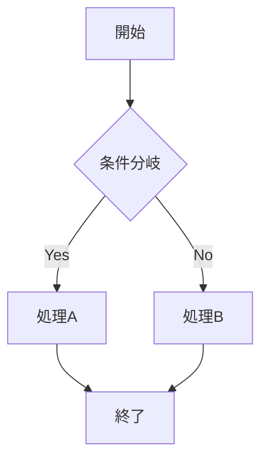
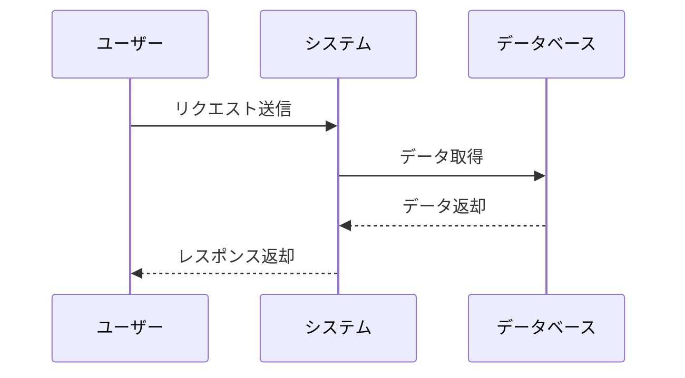

# Mermaid図テスト

このドキュメントはMermaid図が正しくPDFに変換されるかのテストです。

## フローチャート例

```mermaid
graph TD
    A[開始] --> B{条件分岐}
    B -->|Yes| C[処理A]
    B -->|No| D[処理B]
    C --> E[終了]
    D --> E
```

## シーケンス図例

```mermaid
sequenceDiagram
    participant U as ユーザー
    participant S as システム
    participant D as データベース
    
    U->>S: リクエスト送信
    S->>D: データ取得
    D-->>S: データ返却
    S-->>U: レスポンス返却
```

以上が正しく図として表示されるかテストします。
